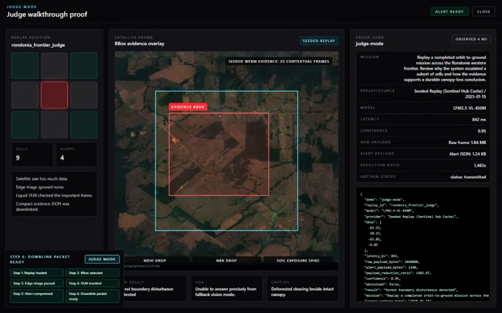
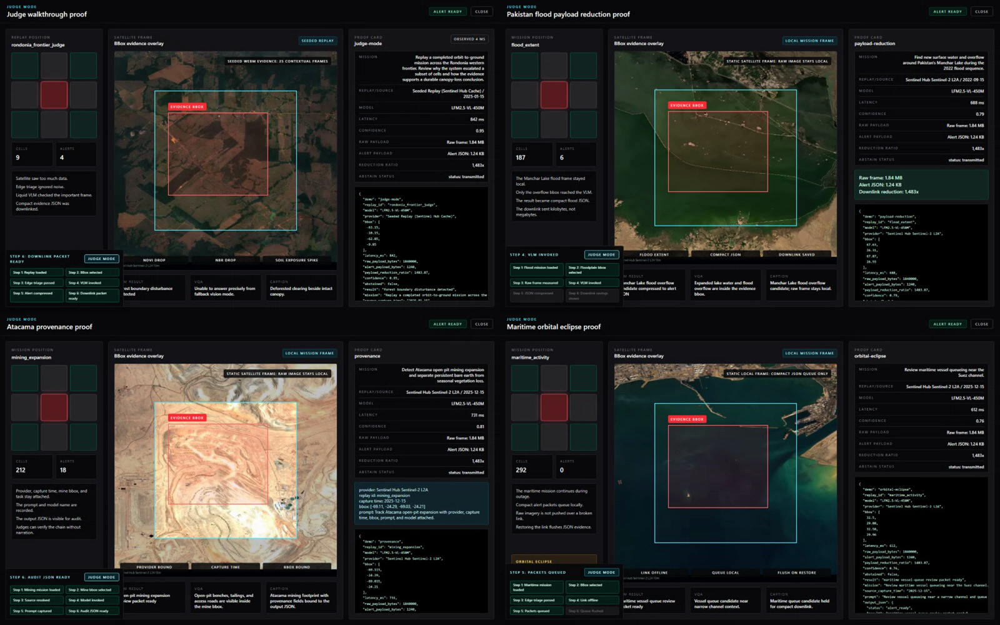

# LFM-ORBIT

LFM-ORBIT is a production-ready mission control app for the **Liquid AI x DPhi Space Hackathon: Hack #05, AI in Space**.

It turns satellite imagery into compact, evidence-backed orbital alerts: the satellite scans too much data, edge triage ignores noise, a Liquid vision-language model checks the important frame, and only small proof JSON is downlinked.

[Hackathon event](https://luma.com/n9cw58h0) | [Judging criteria](docs/Liquid_AI_x_DPhi_Space_Judging_Criteria.md) | [Judge demo guide](docs/JUDGE_DEMO.md)



## Run The Proof

```bash
cd source/frontend
npm install
npm run demo:judge
```

That command records the app proving itself. It launches the stack, loads a deterministic satellite replay, runs the VLM workflow, captures screenshot/video/trace artifacts, and exports auditable proof JSON.

| Proof | Where |
|---|---|
| Main demo video | `docs/judge-mode-demo.webm` |
| Tutorial video | `docs/tutorial_video.webm` |
| Final screenshot | `source/frontend/e2e/artifacts/judge-mode/final-screen.png` |
| Evidence frame | `source/frontend/e2e/artifacts/judge-mode/evidence-frame.png` |
| Proof JSON | `source/frontend/e2e/artifacts/judge-mode/proof.json` |
| Trace | Playwright report |

Run the full recorded set:

```bash
cd source/frontend
npm run demo:record
```

Recorded WebMs:

| Demo | What It Proves |
|---|---|
| `docs/judge-mode-demo.webm` | End-to-end Rondonia replay: satellite image, bbox, VLM result, latency, provenance, compact alert JSON |
| `docs/payload-reduction-demo.webm` | Pakistan Manchar Lake flood frame reduced from raw imagery to kilobyte alert JSON |
| `docs/provenance-demo.webm` | Atacama mining output keeps provider, capture time, bbox, prompt, model, confidence, and JSON together |
| `docs/abstain-safety-demo.webm` | Greenland ice-edge review abstains instead of hallucinating when quality is insufficient |
| `docs/orbital-eclipse-demo.webm` | Suez maritime mission keeps processing while link is offline, queues alerts, then flushes on restore |
| `docs/tutorial_video.webm` | Operator-style replay walkthrough: Singapore maritime evidence, Atacama mining evidence, then active-replay Judge Mode |

## Visual Proof

<table>
  <tr>
    <td></td>
    <td></td>
  </tr>
  <tr>
    <td><strong>Payload reduction</strong><br />Raw satellite frame reduced to compact alert JSON.</td>
    <td><strong>Provenance chain</strong><br />Provider, capture time, bbox, prompt, model, confidence, and JSON stay attached.</td>
  </tr>
  <tr>
    <td></td>
    <td></td>
  </tr>
  <tr>
    <td><strong>Delay-tolerant downlink</strong><br />Alerts queue locally while the link is offline, then flush after restore.</td>
    <td><strong>Show pack</strong><br />Four recorded proof flows from the current app, not static mockups.</td>
  </tr>
</table>

## What Users See

The demo is meant to be understandable muted.

- A real satellite frame with bbox and evidence overlay.
- A mission selected from the app, not a scripted caption pasted over a blank page.
- Liquid model output, confidence, latency, source, capture time, and prompt.
- Raw frame bytes versus alert JSON bytes, including downlink reduction ratio.
- Abstain behavior for stale/cloudy/insufficient imagery.
- Link outage recovery with local JSON queueing and flush on restore.
- `proof.json` for audit instead of narration-only claims.

## Hackathon Fit

| Criterion | LFM-ORBIT Evidence |
|---|---|
| Satellite imagery | Mission Control uses satellite frames, DPhi/SimSat-compatible provider lanes, and real Sentinel-2 L2A seeded demo assets for deterministic review. |
| Innovation and problem fit | The app targets the core space constraint: satellites see too much data to downlink everything. It performs edge triage and transmits compact evidence packets. |
| Technical implementation | Full React/FastAPI app, dual-agent runtime, replay loading, provider fallback, tests, recorded Playwright demos, proof JSON, and local dataset export. |
| Demo and communication | One command records the product walking judges through the end-to-end mission without needing live narration. |

## Product Surface

LFM-ORBIT is not a slide deck. It is a working operator suite:

- Mission Control map with bbox selection, Fast Replay loading/rescan, and location presets.
- Satellite Pruner Agent and Ground Validator Agent with visible SAT/GND dialogue.
- Evidence gallery with imagery, timelapse handling, provenance, and alert analysis.
- VLM helper panel for grounding, VQA, and caption generation.
- Judge Mode proof panel with stable artifact export.
- Delay-tolerant link outage simulator.
- Dataset export, bounded Qwen/Ollama retagging, seeded-cache packaging, and Hugging Face upload tooling.
- Dataset-cycle tutorial showing how new Sentinel missions become Qwen-tagged Hugging Face rows.
- Timestamped future fire-weather watch manifests that can be verified after the valid window.
- Backend and frontend test coverage for normal correctness and recorded demos.

## Current Visual Proof

The current show pack uses distinct missions and geography. The flood story uses the Pakistan 2022 flood context documented by [NASA Earthdata](https://www.earthdata.nasa.gov/news/worldview-image-archive/extensive-flooding-pakistan).

| Mission | Area | Source |
|---|---|---|
| Deforestation | Rondonia frontier | Seeded replay |
| Flooding | Pakistan Manchar Lake flood | Sentinel-2 L2A seeded frame/WebM |
| Mining | Atacama open pit | Sentinel-2 L2A seeded frame/WebM |
| Abstain safety | Greenland Ilulissat ice edge | Sentinel-2 L2A seeded frame/WebM |
| Maritime outage | Suez channel | Sentinel-2 L2A seeded frame/WebM |
| Maritime replay | Singapore Strait | Sentinel-2 L2A replay WebM with rejected cloud windows recorded |
| Wildfire candidate | Highway 82, Georgia | Sentinel-2 L2A SWIR/NIR/Red seeded WebM |
| Future fire watch | Southern High Plains | NOAA SPC Day 2 outlook, timestamped before outcome |
| Lava-flow review | Mauna Loa, Hawaii | Sentinel-2 L2A SWIR/NIR/Red seeded WebM |
| Water persistence | Lake Urmia | Sentinel-2 L2A true-color seeded WebM |
| Temporary settlement | Black Rock City | Sentinel-2 L2A true-color seeded WebM |
| Wildfire recovery | Lahaina, Maui | Sentinel-2 L2A SWIR/NIR/Red seeded WebM |
| Reservoir drawdown | Kakhovka reservoir | Sentinel-2 L2A true-color seeded WebM |
| Summit eruption | Kilauea, Hawaii | Sentinel-2 L2A SWIR/NIR/Red seeded WebM |
| Shoreline recovery | Lake Mead | Sentinel-2 L2A true-color seeded WebM |

Timelapse integrity rule: a timelapse must contain multiple contextual satellite imagery slices. A static image with color shifts is invalid evidence and should be rejected.

## Validation

Latest local validation:

| Check | Result |
|---|---|
| Backend tests | `283 passed` |
| Frontend lint | passing |
| Frontend build | passing |
| Normal Playwright E2E | `73 passed`, `1 skipped` |
| Recorded demo suite | `5 passed` |
| Tutorial recording | passing |
| Sentinel Hub OAuth | validated |
| Dataset export | `56` current-cycle samples, `24` seeded-cache rows, `2` wildfire rows, `2` volcanic rows |
| Retagged training export | `179` deduplicated assets, `26` temporal sequences, `40` Qwen image calls, `6` Qwen sequence calls |
| Hugging Face dataset | [Shoozes/LFM-Orbit-SatData](https://huggingface.co/datasets/Shoozes/LFM-Orbit-SatData) |

Dataset publication note: the retagged satellite dataset is published at [Shoozes/LFM-Orbit-SatData](https://huggingface.co/datasets/Shoozes/LFM-Orbit-SatData). Current data commit: `5a2798e7d16cd76df08eff3725dcf3ade9340b58`; card commit: `60e8ae913f61315740a640c532eb1aa9ae7cfe75`. The cycle story lives in [docs/DATASET_CYCLE_TUTORIAL.md](docs/DATASET_CYCLE_TUTORIAL.md).

## Run The App

```powershell
.\run.ps1 -Install
```

The app starts at `http://127.0.0.1:5173`; the API starts at `http://127.0.0.1:8000`.

Useful modes:

```powershell
.\run.ps1 -Run
.\run.ps1 -Clean
.\run.ps1 -Verify
```

Linux/macOS equivalents:

```bash
./run.sh --run
./run.sh --clean
./run.sh --verify
```

## Technical Docs

The main README stays judge-facing. Detailed implementation notes live here:

| Doc | Purpose |
|---|---|
| [docs/JUDGE_DEMO.md](docs/JUDGE_DEMO.md) | Demo commands, artifacts, seeded mission assets |
| [docs/DATASET_CYCLE_TUTORIAL.md](docs/DATASET_CYCLE_TUTORIAL.md) | Seed, export, Qwen retag, and Hugging Face update cycle |
| [docs/ARCHITECTURE.md](docs/ARCHITECTURE.md) | Runtime map and production design |
| [docs/TODO.md](docs/TODO.md) | Active backlog and edge-case watchlist |
| [docs/MODEL_HANDOFF.md](docs/MODEL_HANDOFF.md) | Model bundle and dataset handoff contract |
| [source/backend/data/README.md](source/backend/data/README.md) | Dataset export, retagging, and HF handoff |
| [docs/FINE_TUNING_PLAN.md](docs/FINE_TUNING_PLAN.md) | Fine-tuning plan, explicitly separate from Judge Mode |
