# LFM Orbit

Satellite-first mission control for temporal Earth-observation triage.

LFM Orbit proves a low-bandwidth dual-agent workflow: a satellite agent sweeps H3 cells and downlinks compact anomaly telemetry, then a ground validator spends bandwidth only where it matters by rebuilding imagery, timelapse evidence, model analysis, operator review, and training records.

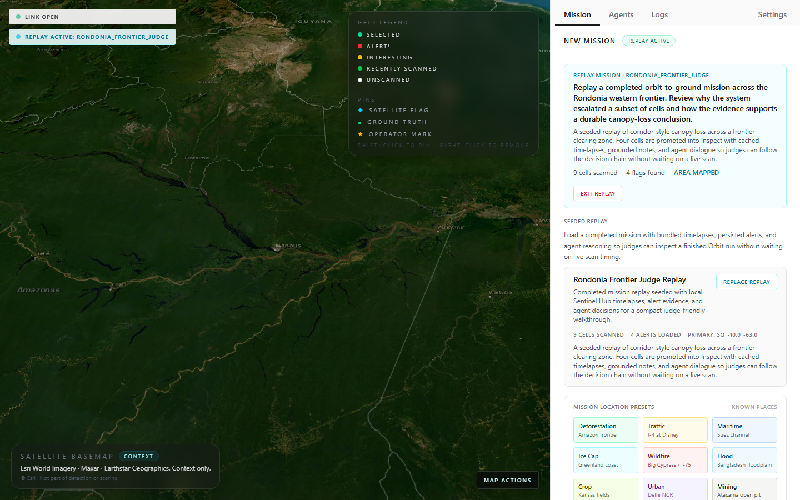

## Visual Proof

Mission presets jump straight to recognizable geography: Amazon deforestation, Florida I-4 transportation mix, Suez maritime activity, Greenland ice, Florida dry-fire risk, Bangladesh flooding, Kansas agriculture, Delhi urban growth, and Atacama mining. The Florida dry-fire target follows April 2026 public context from [Drought.gov](https://www.drought.gov/drought-status-updates/drought-status-update-southeast-2026-04-16), [NIFC](https://www.nifc.gov/fire-information/nfn), and [NASA Earth Observatory](https://science.nasa.gov/earth/earth-observatory/smoke-rises-over-big-cypress-national-preserve/).

<table>
  <tr>
    <td>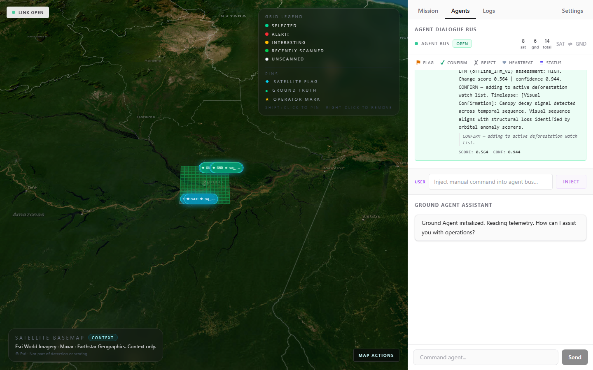</td>
    <td>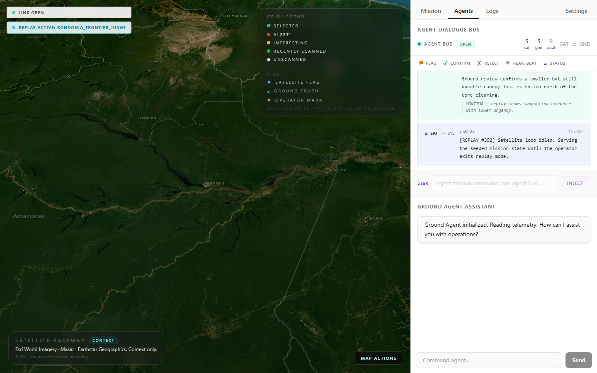</td>
  </tr>
  <tr>
    <td><strong>Satellite heartbeat</strong><br />Live link state, scan cadence, and compact telemetry flow.</td>
    <td><strong>Agent dialogue</strong><br />Replayable SAT/GND reasoning trace with injected operator prompts.</td>
  </tr>
  <tr>
    <td>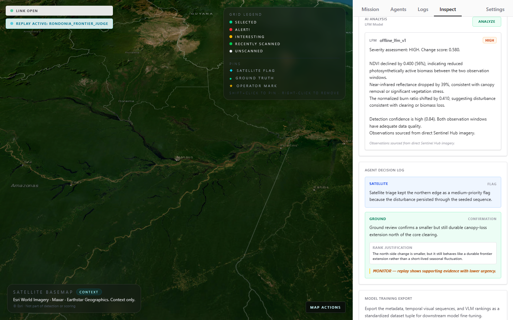</td>
    <td>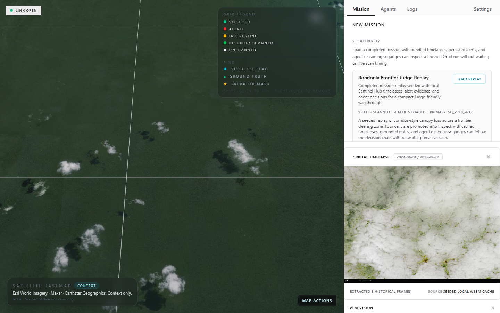</td>
  </tr>
  <tr>
    <td><strong>Alert verdict</strong><br />Before/after evidence, provenance labels, and deterministic offline analysis.</td>
    <td><strong>Temporal proof</strong><br />Real frame sequence evidence, not a tinted single-image animation.</td>
  </tr>
  <tr>
    <td>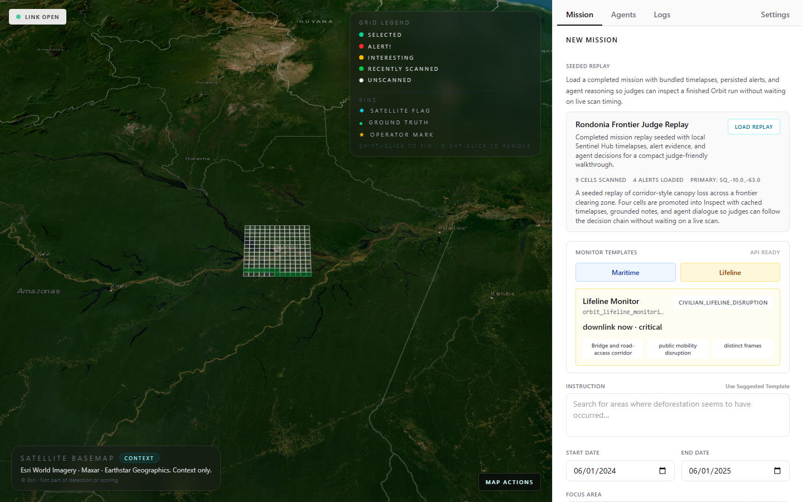</td>
    <td>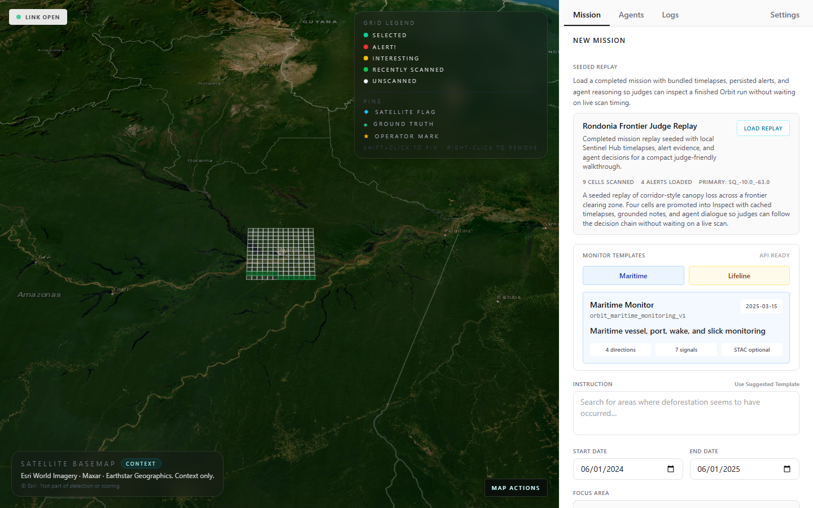</td>
  </tr>
  <tr>
    <td><strong>Lifeline monitoring</strong><br />Strict before/after schemas for civilian access disruption review.</td>
    <td><strong>Maritime monitoring</strong><br />Cardinal investigation planning with optional Sentinel-2 STAC metadata.</td>
  </tr>
  <tr>
    <td>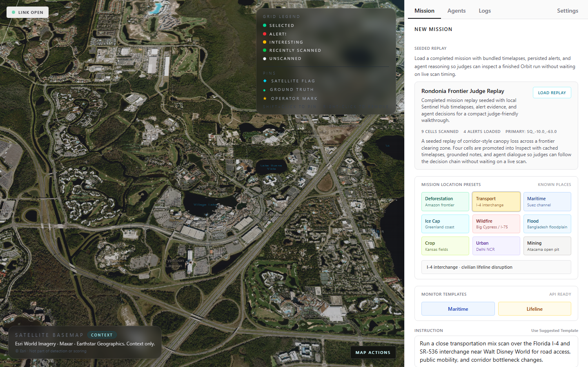</td>
    <td>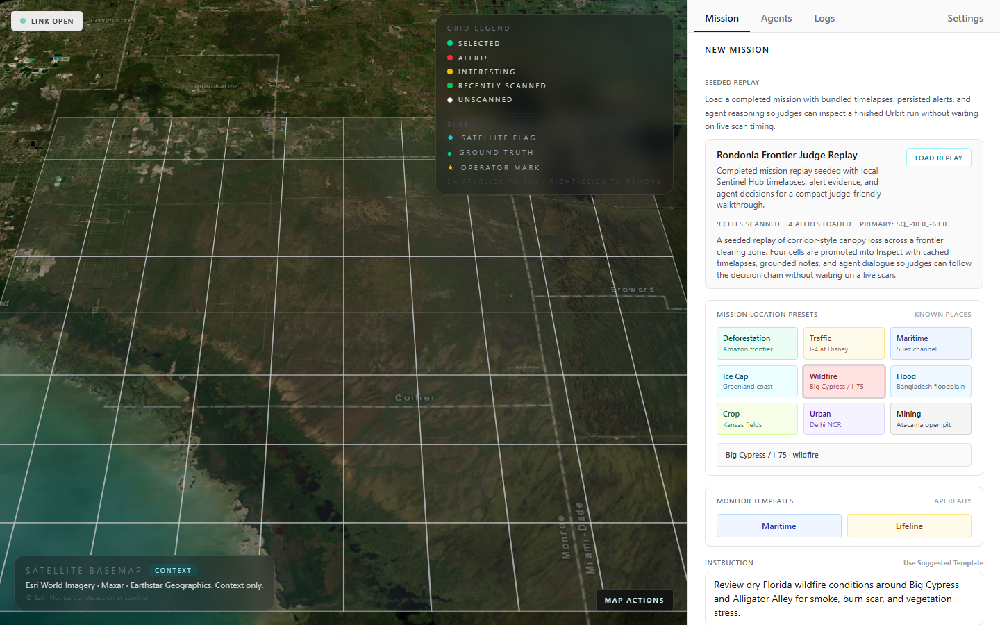</td>
  </tr>
  <tr>
    <td><strong>Transportation mix</strong><br />Up-close I-4 and SR-536 area scan over ramps, roads, parking, water edges, and managed vegetation.</td>
    <td><strong>Florida wildfire watch</strong><br />Big Cypress and Alligator Alley dry-fuel context for smoke and burn-scar review.</td>
  </tr>
  <tr>
    <td>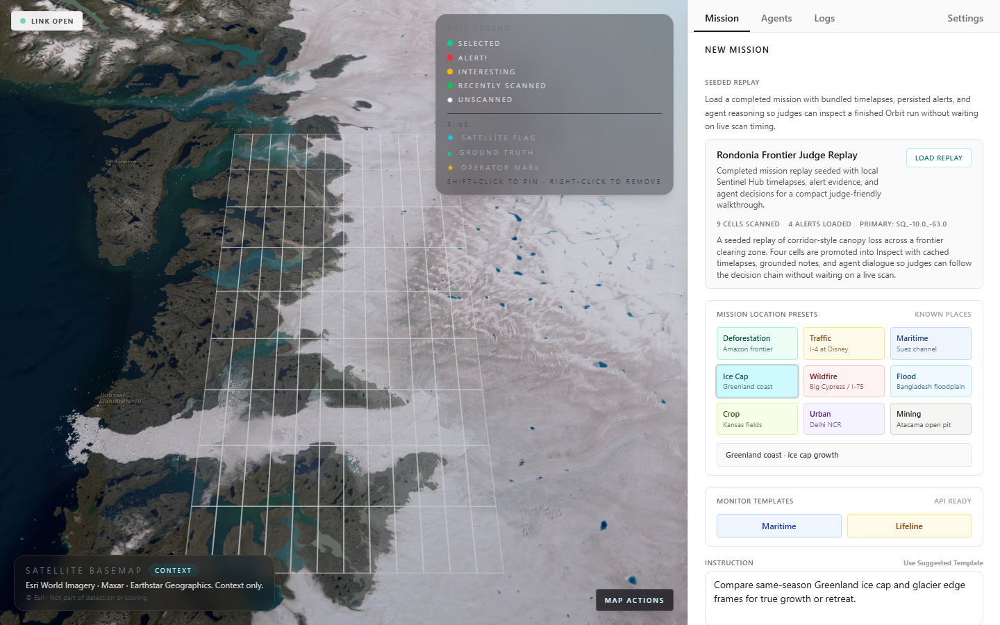</td>
    <td>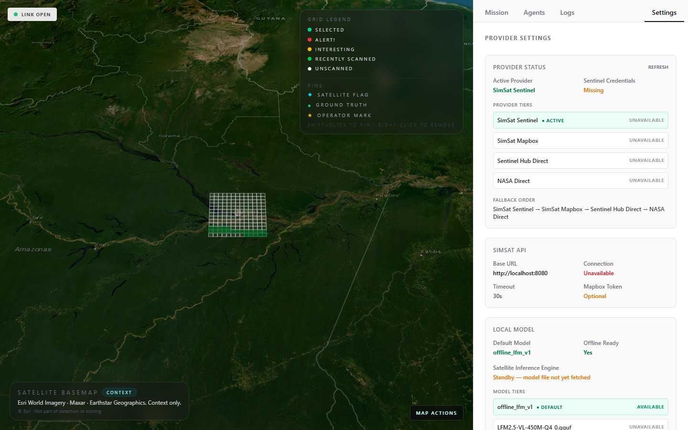</td>
  </tr>
  <tr>
    <td><strong>Ice cap monitoring</strong><br />Greenland coastal ice and glacier edge review with a high-contrast snow/water palette.</td>
    <td><strong>Provider control</strong><br />Live provider, local model, and optional depth status in one operator panel.</td>
  </tr>
  <tr>
    <td>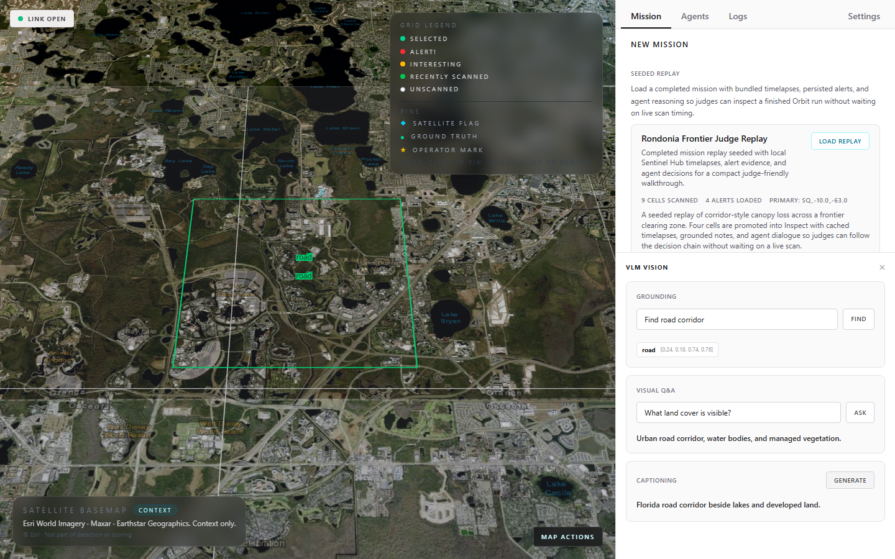</td>
    <td></td>
  </tr>
  <tr>
    <td><strong>VLM helpers</strong><br />Grounding, VQA, captioning, and fallback behavior surfaced to the operator.</td>
    <td><strong>Seeded replay</strong><br />Deterministic completed walkthrough with persisted evidence and agent notes.</td>
  </tr>
</table>

## Why It Exists

- Reduce downlink noise: score broad scan areas on the satellite side and transmit tiny JSON alerts.
- Preserve evidence quality: reconstruct selected cells into imagery, timelapses, provenance, and human-readable reasoning.
- Stay reproducible: seeded replay and offline analysis let reviewers validate the full app with no external secrets.
- Close the training loop: export inspected evidence into JSONL, image, frame, and temporal-sequence datasets.
- Keep optional lanes optional: SimSat, Sentinel Hub, NASA, GEE, local GGUF, and Depth Anything V3 are feature-gated.

## Capabilities

- FastAPI backend with satellite agent, ground validator, telemetry bus, replay state, gallery, and validation APIs.
- React/MapLibre mission UI with scan controls, alerts, map pins, timelapse viewer, VLM helpers, and settings.
- One-click mission location presets for recognizable deforestation, transportation, maritime, ice, wildfire, flood, crop, urban, and mining scenarios.
- Provider routing for seeded/offline fallback, SimSat Sentinel, SimSat Mapbox, Sentinel Hub, NASA, and GEE.
- Maritime and lifeline monitoring primitives with deterministic contracts and tests.
- Dataset export, model evaluation, and retagging tools for API imagery and timelapse frames.
- CI coverage for backend tests, frontend typecheck/build, and Playwright E2E flows.

## Quick Start

Prerequisites:

- Python 3.10+ with `uv`
- Node compatible with `.nvmrc` (`20.19.0`)
- Optional: SimSat running at `SIMSAT_BASE_URL`
- Optional: Sentinel Hub, NASA, GEE, or Mapbox credentials

```powershell
git clone <repo-url>
cd "LFM Orbit"
Copy-Item .env.example .env

.\run.ps1 -Install
```

Linux/macOS:

```bash
cp .env.example .env
./run.sh --install
```

The app starts at `http://127.0.0.1:5173` and the API at `http://127.0.0.1:8000`. Use the Mission replay control for a deterministic completed walkthrough without waiting on live provider traffic.

Useful launcher modes:

```powershell
.\run.ps1 -InstallOnly  # install locked deps without starting dev servers
.\run.ps1 -Run          # start backend + frontend from existing deps
.\run.ps1 -Clean        # clear mutable runtime state for a cold-start demo
.\run.ps1 -Verify       # install deps and run backend, frontend, and E2E checks
```

Linux/macOS equivalents are `./run.sh --install-only`, `./run.sh --run`, `./run.sh --clean`, and `./run.sh --verify`.

## Provider Options

Default `.env` mode is safe for cold starts:

```env
OBSERVATION_PROVIDER=simsat_sentinel
SIMSAT_ENABLED=false
SIMSAT_BASE_URL=http://localhost:8080
DISABLE_EXTERNAL_APIS=true
```

Optional Mapbox through SimSat:

```env
OBSERVATION_PROVIDER=simsat_mapbox
SIMSAT_DATA_SOURCE=mapbox
MAPBOX_ACCESS_TOKEN=pk.your_token
```

Direct provider overrides:

```env
DISABLE_EXTERNAL_APIS=false

OBSERVATION_PROVIDER=sentinelhub_direct
SENTINEL_CLIENT_ID=...
SENTINEL_CLIENT_SECRET=...

OBSERVATION_PROVIDER=nasa_api_direct
NASA_API_KEY=...
```

Provider fallback order is `simsat_sentinel -> simsat_mapbox -> sentinelhub_direct -> nasa_api_direct -> semi_real_loader_v1`.

## Training Data From API Images

Orbit stores and exports training data from the same evidence path operators inspect:

1. Live/replay mission emits satellite alerts and ground decisions.
2. Ground review, VLM helpers, timelapse generation, and imagery endpoints fetch or reuse API-backed image/video assets.
3. `core/observation_store.py`, `core/gallery.py`, and alert persistence preserve cell metadata, bbox/date windows, agent text, thumbnails, and timelapse refs.
4. `scripts/export_orbit_dataset.py` materializes per-sample assets plus JSONL manifests.
5. `scripts/evaluate_model.py` replays the exported samples through the baseline analyzer to create reproducible eval artifacts.

```powershell
cd source/backend
uv run --no-sync python scripts\export_orbit_dataset.py `
  --output-dir ..\..\runtime-data\modeling\orbit-export `
  --monitor-reports-dir ..\..\runtime-data\monitor-reports

uv run --no-sync python scripts\evaluate_model.py `
  --dataset ..\..\runtime-data\modeling\orbit-export `
  --split eval
```

Export output includes `samples.jsonl`, `train.jsonl`, `eval.jsonl`, `training.jsonl`, per-sample `sample.json`, local imagery/video assets when available, temporal use-case metadata, weak negative ground rejects, before/after frame metadata, cached API observation rows, and optional persisted maritime/lifeline monitor-report rows.

Retag every exported image and timelapse frame into deduplicated training assets:

```powershell
cd source/backend
uv run --no-sync python scripts\retag_training_assets.py `
  --dataset-dir ..\..\runtime-data\modeling\orbit-export `
  --provider heuristic

# Optional local vision model path through Ollama.
uv run --no-sync python scripts\retag_training_assets.py `
  --dataset-dir ..\..\runtime-data\modeling\orbit-export `
  --provider ollama `
  --model qwen2.5vl:32b

# Optional OpenAI-compatible vision retagging path.
$env:OPENAI_API_KEY = "..."
uv run --no-sync python scripts\retag_training_assets.py `
  --dataset-dir ..\..\runtime-data\modeling\orbit-export `
  --provider openai `
  --model gpt-4.1-mini
```

The retag pass writes `retagged_training/images/`, `metadata.jsonl`, `retagged_assets.jsonl`, `training_assets.jsonl`, `temporal_sequences.jsonl`, and `training_temporal_sequences.jsonl`. Images and extracted timelapse frames are deduplicated by SHA-256; duplicate sample references are preserved in each row. Videos become sampled still-frame assets plus ordered temporal sequence rows, and videos with fewer than two decoded frames are skipped as invalid temporal evidence.

The retagger can also be copied into a dataset folder and run as `python retag_training_assets.py --dataset-dir .`; it does not require the live Orbit app or SQLite state once the export folder exists.

Optional desktop wrapper:

```powershell
uv run --no-sync python scripts\retag_training_assets_ui.py
```


## Before/After Lifeline Monitoring

Orbit can score civilian lifeline changes from a baseline frame, a current frame, and a strict candidate payload:

```powershell
cd source/backend
@'
from core.lifeline_monitoring import build_lifeline_monitor_report

report = build_lifeline_monitor_report(
    asset_id="orbit_bridge_corridor",
    baseline_frame={"label": "before", "date": "2025-01-01", "asset_ref": "before.png"},
    current_frame={"label": "after", "date": "2025-01-15", "asset_ref": "after.png"},
    candidate={
        "event_type": "probable_access_obstruction",
        "severity": "high",
        "confidence": 0.88,
        "bbox": [0.2, 0.25, 0.65, 0.75],
        "civilian_impact": "public_mobility_disruption",
        "why": "The current frame shows a bridge approach obstruction.",
        "action": "downlink_now",
    },
)
print(report["decision"]["action"])
'@ | uv run --no-sync python -
```

The same capability is exposed at `GET /api/lifelines/assets`, `POST /api/lifelines/monitor`, and `POST /api/lifelines/evaluate`. Invalid schemas, malformed bboxes, or `no_event` outputs safely collapse to `discard`; valid high-confidence material disruptions can escalate to `downlink_now` only when the baseline/current frame pair is proven distinct by date or asset reference.

The Mission tab includes a Lifeline monitor preview card for a one-click visual proof path.

## Maritime Monitoring

Orbit includes maritime monitoring inside the main app backend:

```powershell
cd source/backend
@'
from core.maritime_monitoring import build_maritime_monitor_report
print(build_maritime_monitor_report(lat=29.92, lon=32.54, timestamp="2025-03-15")["mode"])
'@ | uv run --no-sync python -
```

The same capability is exposed at `POST /api/maritime/monitor`. It builds a deterministic maritime use-case report, optional Element84 Sentinel-2 STAC scene metadata, and N/E/S/W investigation targets without requiring a separate app or remote VLM key.

The Mission tab includes a Maritime monitor preview card that renders the API contract and cardinal investigation count.

## Local Model Lane

The app always has `offline_lfm_v1` for deterministic CPU analysis. Optional satellite-side GGUF reasoning is manifest-resolved under `runtime-data/models/lfm2.5-vlm-450m/`.

```powershell
.\run.ps1 -Install -FetchModel

cd source/backend
uv run --no-sync python scripts\fetch_satellite_model.py `
  --source-manifest C:\path\to\orbit_model_handoff.json
```

`source/frontend/utils/depthMapStats.ts` adds a WebGL shader helper for fast depth-map texture summaries with CPU fallback. It is ready for the image-conditioned depth-verification lane once real depth-map artifacts are wired in.

Optional Depth Anything V3 support is feature-gated so normal local, offline, and CI runs do not require the heavyweight DA3 package:

```env
DEPTH_ANYTHING_V3_ENABLED=false
DEPTH_ANYTHING_V3_MODEL=depth-anything/da3-large
DEPTH_ANYTHING_V3_DEVICE=auto
DEPTH_ANYTHING_V3_MAX_PIXELS=1048576
```

The backend exposes `GET /api/depth/status`, `POST /api/depth/settings`, and `POST /api/depth/estimate`. The Settings tab can toggle the current server-session flag and reports whether the optional `depth_anything_3` package is installed.
When `DEPTH_ANYTHING_V3_DEVICE=auto`, the backend resolves to CUDA when available and CPU otherwise.

## Verification

```powershell
.\run.ps1 -Verify
```

Current local validation state on April 27, 2026:

- `source/frontend`: `npx -y -p node@20.19.0 -p npm@10.8.2 npm ci` -> passing with the CI Node/npm lane
- `uv run --no-sync pytest -q` -> `242 passed`
- `npm run lint` -> passing
- `npm run build` -> passing
- `npm run test:e2e` -> `72 passed`, `1 skipped` debug-only HTML dump
- `.\run.ps1 -Verify` -> passing from repo root; the backend, frontend, and E2E component checks above were rerun after the latest preset and screenshot updates.
- README/docs screenshots regenerated at `1440x900` with artifact dimension checks passing.

Current integrity baseline:

- Operator-facing failures are surfaced for mission validation, settings status, VLM actions, Ground Agent chat, agent-bus injection, timelapse generation, and map-pin sync.
- Map markers render agent/operator labels as DOM text, and map-pin API calls use bounded requests with visible failure feedback.
- Runtime reset, seeded replay, shared Playwright navigation, and opt-in server reuse keep E2E runs deterministic instead of depending on stale local state.
- Evidence provenance labels distinguish live provider fetches, seeded replay/cache assets, provided assets, and offline fallbacks.
- Dataset export and retagging close the loop from app evidence to deduplicated image/frame/sequence training rows with optional Ollama/OpenAI-compatible relabeling.
- Optional model/depth lanes stay disabled unless configured, and malformed payloads fail before expensive optional model startup.
- Detailed completed-history notes live in `docs/TODO.md`; this README keeps the runnable state and high-signal current behavior.

Manual equivalent:

```powershell
cd source/backend
uv sync --extra dev --locked
uv run --no-sync pytest

cd ..\frontend
npm ci
npm run lint
npm run build
npx playwright test
```

GitHub Actions mirrors the backend tests, frontend typecheck/build, and Playwright suite.

## Judge Visuals

Regenerate the judge-facing screenshot set with:

```powershell
cd source/frontend
npx playwright test e2e/capture_screenshots.spec.ts e2e/monitor_features.spec.ts e2e/debug_dashboard.spec.ts e2e/vlm.spec.ts e2e/app.spec.ts --grep "Visual evidence capture|Context Module|screenshot:|visual proof|Satellite 8080|VLM Grounds"
```

Primary artifacts are written under `source/frontend/e2e/screenshots/`. README-facing copies live under `docs/`: `01-satellite-heartbeat.png`, `02-agent-dialogue-bus.png`, `03-alert-analysis-verdict.png`, `04-settings-provider-model.png`, `05-mission-control-scanning.png`, `06-lifeline-monitor-preview.png`, `07-maritime-monitor-preview.png`, `08-traffic-i4-preview.png`, `09-florida-wildfire-preview.png`, `10-greenland-ice-preview.png`, `ffmpeg-timelapse-viewer.png`, and `vlm-panel-results.png`.

## Project Map

- `README.md`, `docs/ARCHITECTURE.md`, and `docs/TODO.md` are the canonical state, architecture, and backlog docs.
- `source/backend/api/main.py`: FastAPI app, REST/WebSocket endpoints, agent lifespan.
- `source/backend/core/`: providers, mission state, scoring, timelapse, replay, gallery, telemetry, training export support.
- `source/backend/scripts/`: model fetch, dataset export, eval, drift/promotion helpers.
- `source/backend/test_wms.py`, `source/backend/test_evalscript.py`: safe manual Sentinel Hub probes; they require env credentials and are covered by import-contract checks.
- `source/frontend/`: React mission UI, MapLibre visualizer, validation panels, VLM/timelapse side panels, settings, Playwright tests.
- `docs/ARCHITECTURE.md`: deeper runtime map and constraints.
- `docs/TODO.md`: active backlog.
- `docs/MODEL_HANDOFF.md`: model bundle and training-result contract.
