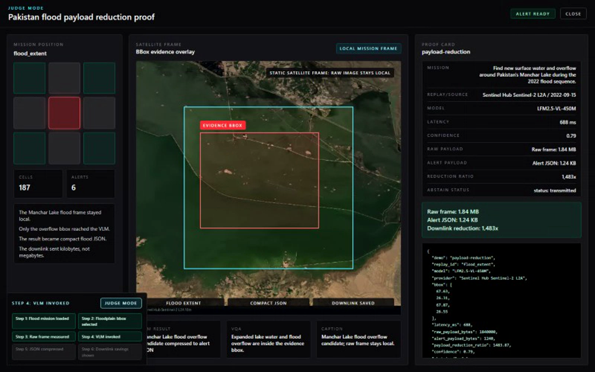
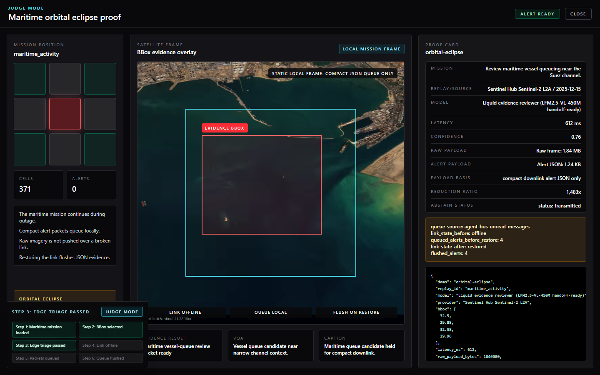
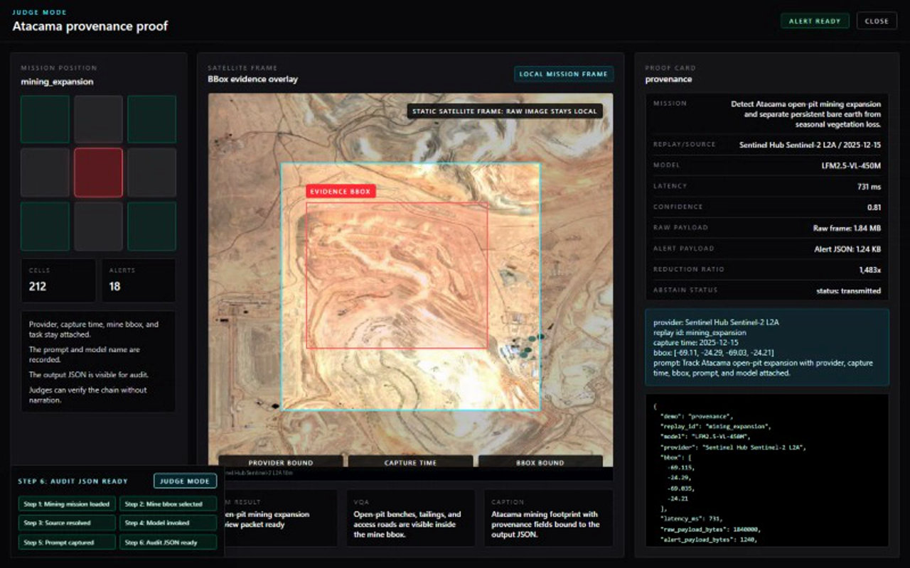

# LFM-ORBIT

Satellites capture more imagery than they can downlink. LFM-ORBIT runs onboard triage: a satellite pruner scans each pass, rejects low-value frames, wakes local Liquid evidence reasoning only for anomalies, and transmits compact proof JSON instead of raw imagery.

A 1-2 KB alert with bbox, confidence, provenance, model output, and payload accounting can move during a narrow contact window. Raw imagery can wait, or never be sent.

[Hackathon event](https://luma.com/n9cw58h0) | [Judge demo guide](docs/JUDGE_DEMO.md) | [Architecture](docs/ARCHITECTURE.md) | [Model handoff](docs/MODEL_HANDOFF.md)


## Run The Judge Proof

```bash
cd source/frontend
npm ci
npm run demo:judge
```

The proof loads deterministic replay evidence, runs the UI flow, and writes video, screenshot, trace, and `proof.json` artifacts. No Sentinel Hub credentials are needed for the judge path.

Full repo verification:

```powershell
.\run.ps1 -Verify
```

```bash
./run.sh --verify
```

## What Judges Should See First

- DPhi SimSat is the primary runtime lane: `provider=simsat_sentinel`, `runtime_truth_mode=realtime`, `imagery_origin=simsat`, `scoring_basis=proxy_bands`.
- Agent 1 prunes scan cells before downlink.
- Agent 2 reviews retained evidence packets: bbox, source, temporal/proxy scores, confidence, and visual evidence references.
- Link outages queue compact JSON alerts in the backend agent bus and flush after restore.
- The Ground Agent chat can take local actions: load/rescan replay, start mission packs from context, and toggle the SAT/GND link simulator.

## Proof Gallery

### 01. Scan And Prune


The satellite-side pruner scans the mission bbox, rejects low-value cells, and promotes only retained evidence packets for review.

### 02. Payload Reduction



Judge proof: `1.84 MB` raw frame -> `1.24 KB` alert JSON, a `1,483x` reduction. Raw imagery stays onboard; compact proof moves.

### 03. Orbital Eclipse Queue



During link loss, alerts queue locally and flush after contact returns. Proof JSON exposes `link_state_before`, `queued_alerts_before_restore`, `flushed_alerts`, and `queue_source=agent_bus_unread_messages`.

### 04. Provenance And Audit



Every alert keeps provider, capture time, bbox, evidence path, confidence, prompt/model metadata, and payload accounting attached.

### 05. Abstain Safety


Bad imagery does not become a confident answer. Cloud/no-data gates, spectral contracts, and replay integrity checks can withhold transmission.

Current runtime: SimSat-first imagery lane, deterministic replay fixtures for judging, and Liquid evidence-packet reasoning when a manifest-resolved local model runtime is available. Production image-conditioned `mmproj` inference is not claimed.

## Validation Snapshot

| Check | Current State |
|---|---|
| Root verify | `.\run.ps1 -Verify` passing |
| Backend tests | `317 passed` |
| Frontend | typecheck + build passing |
| Playwright E2E | `73 passed`, `1 skipped` |
| Recorded demos | judge, payload, provenance, abstain, eclipse |
| Dataset export | `56` samples, `24` replay-cache rows |
| Retagged training set | `179` assets, `26` temporal sequences |
| Dataset | [Shoozes/LFM-Orbit-SatData](https://huggingface.co/datasets/Shoozes/LFM-Orbit-SatData) |
| Trained model | [Shoozes/lfm2.5-450m-vl-orbit-satellite](https://huggingface.co/Shoozes/lfm2.5-450m-vl-orbit-satellite) |

## Model And Dataset Handoff

Pull the trained Orbit GGUF bundle into `runtime-data/models/lfm2.5-vlm-450m/`:

```powershell
.\run.ps1 -Install -FetchModel
```

```bash
./run.sh --install --fetch-model
```

This writes `model_manifest.json`, preserves `orbit_model_handoff.json` as `source_handoff.json`, and stores `training_result_manifest.json`. The launchers install the optional `llama-cpp-python` runtime when supported; Linux/WSL hosts without compiler support still complete the core install and boot safely.

Dataset export, retagging, and Hugging Face upload details live in [docs/DATASET_CYCLE_TUTORIAL.md](docs/DATASET_CYCLE_TUTORIAL.md).

## Run Locally

```powershell
.\run.ps1 -Install
.\run.ps1 -Run
```

```bash
./run.sh --install
./run.sh --run
```

App: `http://127.0.0.1:5173`

API: `http://127.0.0.1:8000`

## Limits

- This is a demo-ready research prototype, not unattended production autonomy.
- Scope is locked to stability fixes, small visual polish, and sharper SAT/GND/CV/LFM response wording.
- DPhi SimSat scoring is truthfully labeled `proxy_bands`.
- Multispectral claims are limited to direct/replay metadata lanes such as ice/snow NDSI with SCL rejection and persistence.
- Fallback paths must stay labeled as fallback and must not become high-confidence detections.

## Docs

| Doc | Purpose |
|---|---|
| [docs/JUDGE_DEMO.md](docs/JUDGE_DEMO.md) | Demo commands, artifacts, and replay assets |
| [docs/ARCHITECTURE.md](docs/ARCHITECTURE.md) | Runtime map and design notes |
| [docs/TODO.md](docs/TODO.md) | Active backlog and edge-case watchlist |
| [docs/DATASET_CYCLE_TUTORIAL.md](docs/DATASET_CYCLE_TUTORIAL.md) | Seed, export, retag, and Hugging Face cycle |
| [docs/MODEL_HANDOFF.md](docs/MODEL_HANDOFF.md) | Model bundle and dataset handoff contract |
