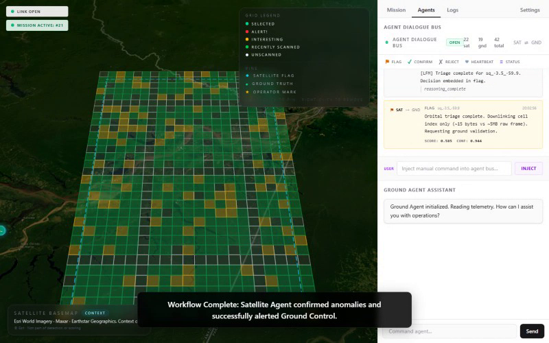

# LFM Orbit — Canopy Sentinel

**Built for the Liquid AI "AI in Space" Hackathon ($5k Track)**

LFM Orbit is an **autonomous edge-compute triage system** designed to run satellite-constrained orbital inference locally, eliminating the need for cloud AI APIs. Install once with an internet connection, then operate fully offline thereafter.

By analyzing high-resolution multispectral imagery (Sentinel-2 10m via Google Earth Engine) directly in orbit, Canopy Sentinel filters vast wilderness areas for deforestation. It uplinks **efficient, structured alerts** (~15-byte cell-index flags) to the ground rather than streaming gigabytes of raw video downlink. The Ground Station then reviews these flags, requesting raw visual timelapses *only* when human validation is required.

---

## Proof of Operation

| Claim | Status |
|---|---|
| Local model fetched at install (LFM2.5 VLM 450m) | Verified — real HTTP download, skips on re-run |
| No external AI API required at runtime | Verified — all analysis paths are offline/local |
| Runs locally/offline after install | Verified — no network dependency at runtime |
| Satellite API support retained with graceful fallback | Verified — SimSat → Sentinel Hub → NASA GIBS |
| Ground analysis always available | Verified — `offline_lfm_v1` runs CPU-only |

---

## Hackathon Tracks & Problem/Solution Fit

This project targets both the **General AI Track** and the **Liquid Track**.

### 1. Satellite Imagery Integration (Domain Application)
* **Core Data:** Real Google Earth Engine Sentinel-2 10m cloud-masked composites as the primary observation layer, with NASA GIBS HLS 30m / MODIS 250m as a reliable fallback.
* **Temporal Continuity:** The platform reconstructs 2-year seasonal multispectral windows, allowing agents to analyze canopy stress over time despite typical Amazonian cloud-cover constraints.

### 2. Innovation and Problem-Solution Fit (Why Run in Orbit?)
* **The Challenge (Bandwidth & Latency):** LEO satellites generate massive imagery volumes daily, yet downlink bandwidth remains highly constrained. Identifying illegal deforestation in the Amazon currently requires transmitting gigabytes of unaffected forest imagery to Earth before processing can begin.
* **The Solution (Dual-Agent System):**
  * **The Satellite Agent (In-Orbit):** Operates continuously on the edge. It reads offline spatial grids, monitors for immediate spectral deltas (NDVI/NBR drops), and triggers a local Liquid Foundation Model (LFM2.5) to reason over the anomalies. It then downlinks a highly compressed cell-index flag (~15 bytes vs ~5 MB raw frame).
  * **The Ground Agent (On-Earth):** Receives and parses these intelligence flags, rendering them via Mapbox. The ground user requests high-resolution raw `.webm` timelapses for a specific cell *only* when the AI indicates high confidence.
* **Result:** Over 99.9% bandwidth savings compared to raw video streaming.

### 3. Technical Implementation
* **Install online, run offline:** First-time install requires internet for model fetch only. All subsequent runs work locally without any external AI calls.
* **No external AI API:** `llama-cpp-python` runs `LFM2.5-VL-450M-Q4_0.gguf` inference locally. Ground analysis uses `offline_lfm_v1` — a deterministic signal analyzer that is always available.
* **Satellite provider support:** SimSat and Sentinel Hub are imagery/data sources, not AI dependencies. They degrade gracefully when offline.
* **Data Seeding:** Every visual confirmation verified by the Ground Station generates labeled dataset points saved to the `observation_store`.

---

## Setup

> **First-time install requires internet.** The install fetches the LFM2.5 VLM 450m model weights over HTTP and vendors SimSat. Subsequent runs work fully offline.

### Storage requirement
The LFM2.5 VLM 450m model is approximately **300 MB** (`LFM2.5-VL-450M-Q4_0.gguf`). Ensure sufficient disk space before installing.

### Windows
```powershell
.\run.ps1
# Select: 1. Install/Repair (fetches models) -> Run
```

> **Tip (CMD):** If you prefer the Windows Command Prompt, run `run.bat` — it calls `run.ps1` automatically.

### Linux / Mac
```bash
bash run.sh
# Select: 1. Install/Repair (fetches models) -> Run
```

Once the install completes, select **2. Run** on subsequent launches — no re-download occurs if the model is already valid.
Use **3. Clean** to wipe the local SQLite runtime state for a cold start.

### Custom model URL
If the default HuggingFace URL is unavailable:
```powershell
# Windows
$env:LFM_MODEL_URL = "https://your-mirror.example.com/LFM2.5-VL-450M-Q4_0.gguf"
.\run.ps1
```
```bash
# Linux/Mac
export LFM_MODEL_URL="https://your-mirror.example.com/LFM2.5-VL-450M-Q4_0.gguf"
bash run.sh
```

### Troubleshooting interrupted downloads
If a download is interrupted, the script detects the incomplete file (< 1 MB) and re-downloads automatically. To reset manually, delete `runtime-data/models/lfm2.5-vlm-450m/LFM2.5-VL-450M-Q4_0.gguf` and re-run Install.

---

## Demo Walkthrough

Once Mission Control is up:
1. Navigate to the **Mission** tab and draw a bounding box over the Amazon (e.g., Rondônia, Brazil).
2. The UI pre-fills with a mission objective ("Scan this region for recent clear-cut deforestation").
3. Click **Launch Mission**.
4. The system activates the **Satellite Agent Simulation**. Switch to the **Agents** tab to monitor the AI telemetry stream in real-time.
5. High-confidence alerts populate the **Alerts** pane.
6. Expand any alert and click **Analyze** — the offline LFM agent provides detailed reasoning on multispectral pixel values.
7. Right-click the flagged map cell to generate a **Temporal Timelapse**.

---

## Proof of Work

(Recorded E2E Playwright validation of the full satellite-to-ground UI)



> [!NOTE]
> Playwright tests boot the sandbox fully offline, testing edge-compute and temporal bounding boxes seamlessly. The backend pytest suite currently passes 117 tests.

### Visual Evidence — The Dual-Agent Pipeline in Action

**1. The Satellite Edge Engine (In-Orbit Debug Log)**
Running continuous offline triage on the constrained edge hardware. This python daemon manages the H3 spatial chunks and invokes the localized LLM.
```log
INFO:satellite_daemon: Boot sequence complete. Model LFM2.5-VLM loaded (Q4_0).
INFO:satellite_daemon: Grid H3_894a8c - DELTA < 0.1. Discarding...
INFO:satellite_daemon: Grid H3_894a8d - ANOMALY (NDVI drop 0.42). Waking LFM...
DEBUG:lfm_inference: Reasoning => "Canopy density reduced abruptly indicating clear-cut logging patterns."
INFO:downlink_tx: Compressing payload... Transmitting cell-index flag to Ground Station (~15 bytes vs ~5 MB raw frame)... DOWNLINK OK.
```

**2. Mission Control & Satellite Sweep**
The autonomous **Satellite Agent** continuously scans Amazonian H3 cells, scoring spectral deltas to find regions suffering from loss of biomass (like deforestation). Hundreds of empty chunks are discarded locally in orbit, drastically saving downlink bandwidth.

> Screenshots below are captured by the E2E suite (`npx playwright test capture_screenshots.spec.ts`).


**3. The Agent Dialogue Bus & Heartbeat**
A continuous connection between Orbit (SAT) and Earth (GND). Notice the minimal, periodic **heartbeats** confirming the edge model is responsive, and the full chat-logs where only severe anomalies are transmitted down.


**4. Ground Validation & Temporal Analysis**
Once an anomaly is flagged, Ground Control analyzes the temporal evidence (pre- and post-event pixel values, NDVI drops).


**5. Provider Settings & Offline Readiness**
The inference engine configuration defaults to the **Offline LFM model**, ensuring no external AI dependencies are required for production.


---

## Documentation

| Document | Description |
|---|---|
| [docs/ARCHITECTURE.md](docs/ARCHITECTURE.md) | Full stack overview, directory layout, inference paths, and provider pipeline details |
| [docs/CODEX_TASKS.md](docs/CODEX_TASKS.md) | Acceptance criteria and pass/fail checks for each architectural requirement |

---

## Architecture Stack

- **Frontend:** React + Vite + Mapbox GL (Mission Control UI).
- **Backend:** FastAPI + SQLite (Agent radio bus, observation store, and GEE local REST cache).
- **Inference Engine:** `llama-cpp-python` running `LFM2.5-VL-450M-Q4_0.gguf` locally — no external AI API required at runtime.
- **Satellite Imagery:** SimSat (hackathon provider) → Sentinel Hub → NASA GIBS (fallback chain).
- **Tools/Workflow:** Playwright E2E testing. Code structure driven by AI agent script runners.

---

*Built for the LiquidAI x DPhi Space Hackathon 2026 — By Shoozes.*
