# LFM-ORBIT

Satellites capture more imagery than they can downlink. LFM-ORBIT runs onboard triage: a satellite pruner scans each pass, rejects low-value frames, wakes local Liquid evidence reasoning only for anomalies, and transmits compact proof JSON instead of raw imagery.

A 1-2 KB alert with bbox, confidence, provenance, model output, and payload accounting can move during a narrow contact window. Raw imagery can wait, or never be sent.

[Hackathon event](https://luma.com/n9cw58h0) | [Docs](docs/README.md) | [Demo guide](docs/DEMO_GUIDE.md) | [Tutorial video](docs/media/videos/tutorial_video.webm)

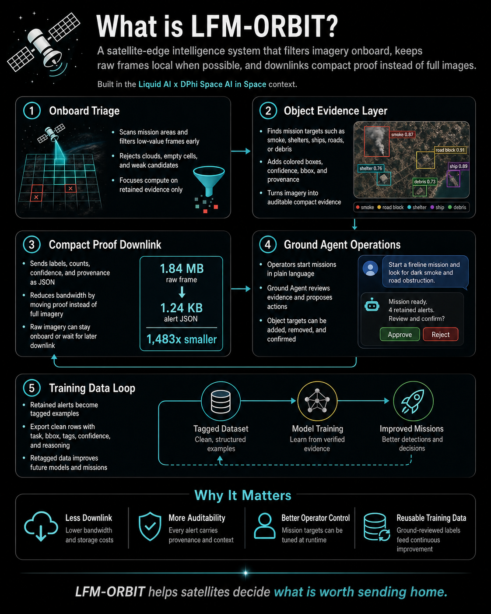

## Run The Showcase

```bash
cd source/frontend
npm ci
npm run demo:showcase
```

The showcase loads deterministic Critical Minerals Expansion Watch replay evidence, runs the UI flow, and writes video, screenshot, trace, and `proof.json` artifacts. No Sentinel Hub credentials are needed for the showcase path.

Local prerequisites are Python `3.10+` and Node.js `20.19.0` from `.nvmrc` or Node.js `22.12.0+`. The launchers bootstrap repo-local `uv` under `runtime-data/tools/` when it is not already installed, so `uv` is not a separate manual prerequisite. In WSL, `run.sh` can use native Linux `node` or Windows `node.exe` when `npm` is visible on `PATH`.

Full repo verification:

```powershell
.\run.ps1 -Verify
```

```bash
./run.sh --verify
```

## Highlights

- The main story is Critical Minerals Expansion Watch over the Salar de Atacama / Escondida / Atacama mining corridor: long-term industrial land change with clear region boxes, commercial relevance, environmental relevance, and safe evidence boundaries.
- DPhi SimSat is the primary runtime lane: `provider=simsat_sentinel`, `runtime_truth_mode=realtime`, `imagery_origin=simsat`, `scoring_basis=proxy_bands`.
- Agent 1 prunes scan cells before downlink.
- Agent 2 reviews retained evidence packets: bbox, source, temporal/proxy scores, confidence, and visual evidence references.
- Mission target packs stay attached to alerts and Proof Mode instead of adding a separate operator panel.
- Link outages queue compact JSON alerts in the backend agent bus and flush after restore.
- Ground Agent proposes and confirms local actions before mutation: replay loads/rescans, mission packs, SAT/GND link changes, and semantic camera moves to known location contexts.

## Proof Gallery

### 01. Critical Minerals Expansion Watch

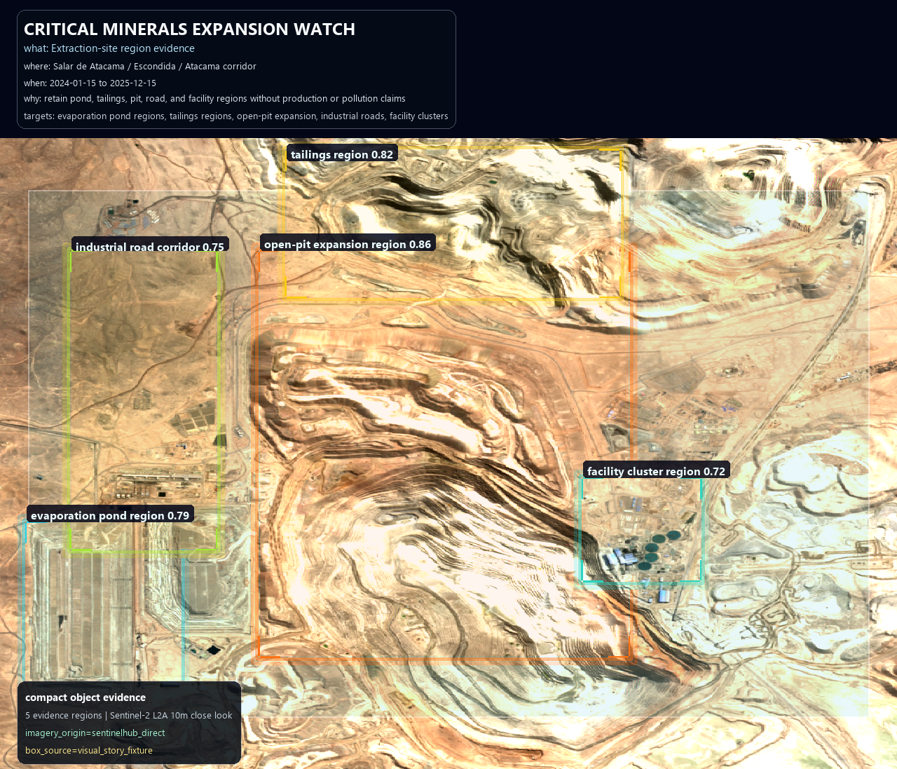

LFM-ORBIT monitors long-term industrial extraction change from orbit. It boxes retained regions such as evaporation ponds, tailings, open-pit expansion, industrial roads, facility clusters, exposed soil, and surface color change, then downlinks compact proof JSON instead of raw imagery. The proof intentionally avoids claims about illegal mining, pollution confirmation, or production output without external validation.

The public source basis is strong: USGS shows Salar de Atacama lithium mining expansion between 1993 and 2015 with blue evaporation ponds visible in Landsat imagery, and NASA Earthdata identifies Salar de Atacama as Chile's largest salt flat and a major active lithium source.

### 02. Scan And Prune

The satellite-side pruner scans the mission bbox, rejects low-value cells, and promotes only retained evidence packets for review. The proof surface now focuses on current artifacts under `docs/media/` instead of stale root-level screenshots.

### 03. Payload Reduction

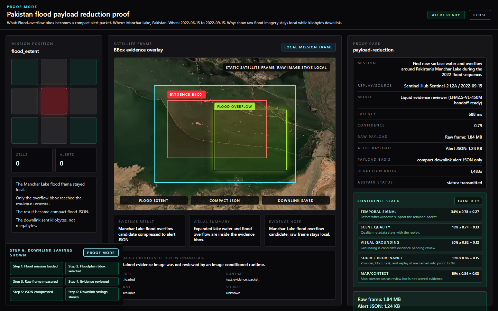

Payload proof: `1.84 MB` raw frame -> `1.24 KB` alert JSON, a `1,483x` reduction. Raw imagery stays onboard; compact proof moves.

### 04. Orbital Eclipse Queue

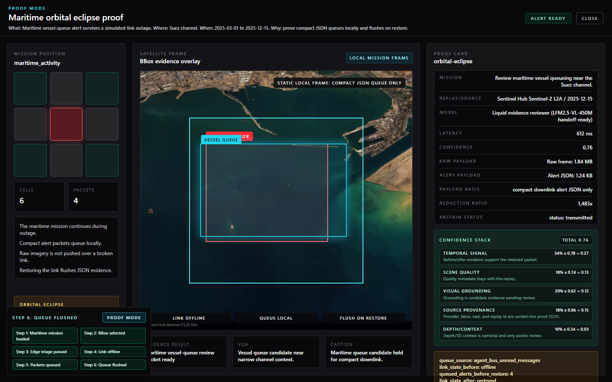

During link loss, alerts queue locally and flush after contact returns. Proof JSON exposes `link_state_before`, `queued_alerts_before_restore`, `flushed_alerts`, and `queue_source=agent_bus_unread_messages`.

### 05. Target-Pack Proof

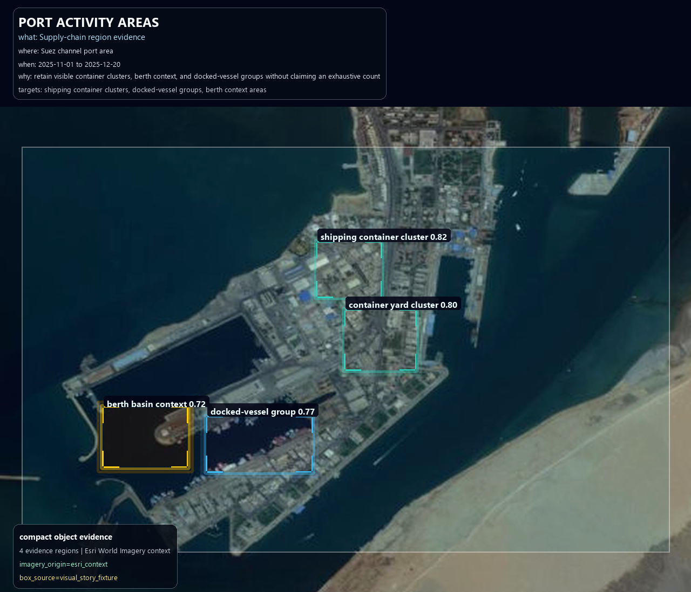

Mission target packs define what retained evidence should preserve. The normal Mission tab stays focused on plan, progress, and timelapse; target-pack details travel with alerts, replay snapshots, dataset rows, and Proof Mode. The public port plate is a visually audited fixture with group/area boxes on visible shipping container clusters, docked-vessel groups, and berth context.

The legacy recorded pass is retained in `docs/media/videos/object-evidence-demo.webm` as audit history, not a current Mission-tab tool.

### 06. Provenance And Audit

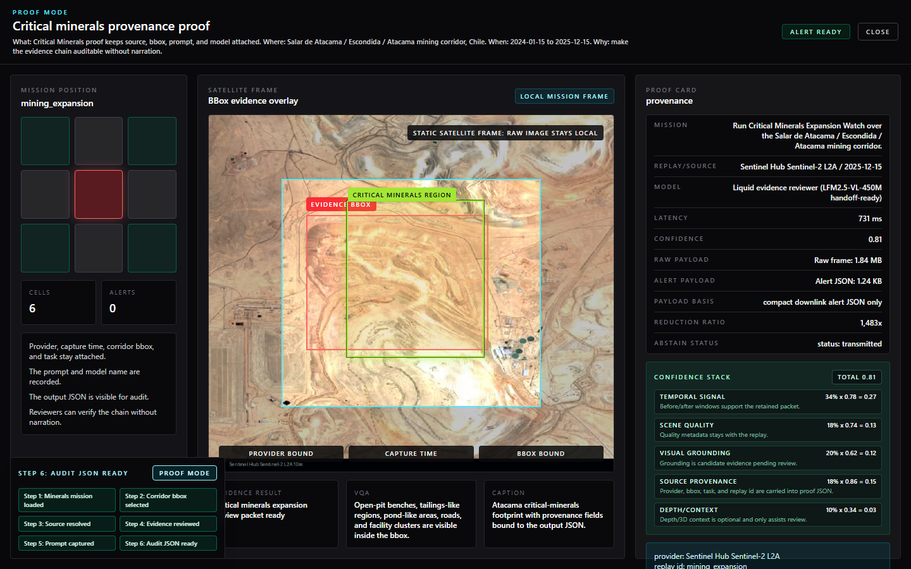

Every alert keeps provider, capture time, bbox, evidence path, confidence, prompt/model metadata, and payload accounting attached.

### 07. Abstain Safety

Bad imagery does not become a confident answer. Cloud/no-data gates, spectral contracts, replay integrity checks, and timelapse-integrity checks can withhold transmission. The current recorded proof is `docs/media/videos/abstain-safety-demo.webm`.

### 08. Timelapse Highlight

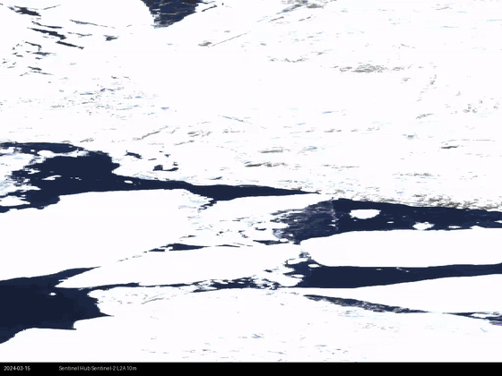

Sentinel Hub close-look replay: Sentinel-2 L2A frames around the Greenland Ilulissat ice edge, rendered as a README-safe GIF under GitHub's 10 MB inline image limit. The [WebM version](docs/media/timelapse/highlight-greenland-ice-timelapse.webm) stays available for higher-quality playback. This is contextual ice/snow extent evidence, not a volume estimate or sub-meter view.

### 09. Chat-Driven Ground Operations

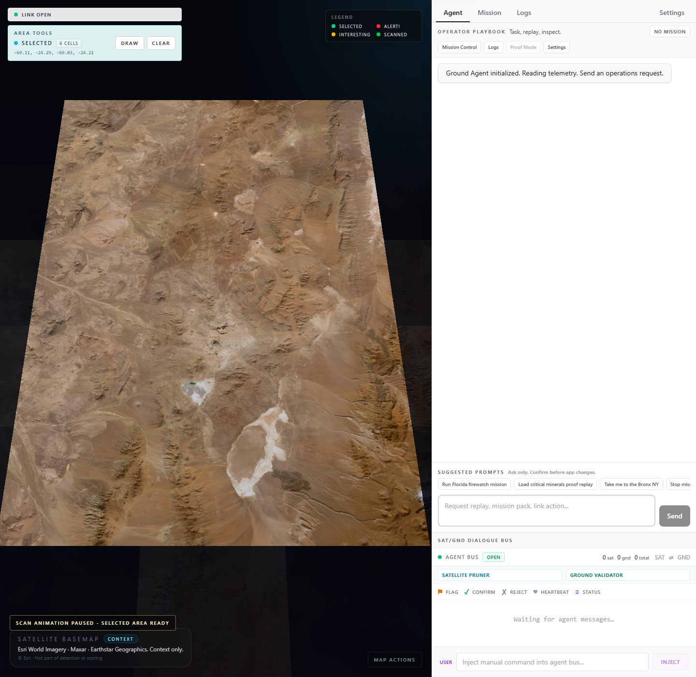

Ground Agent is the operator interface: SAT/GND roles, app navigation, replay loading, mission packs, and link simulation are available from one panel. Mutating actions still use review cards before state changes; see the [proposal proof](docs/media/readme/readme-ground-agent-chat-action.png).

### 10. Semantic Location Camera

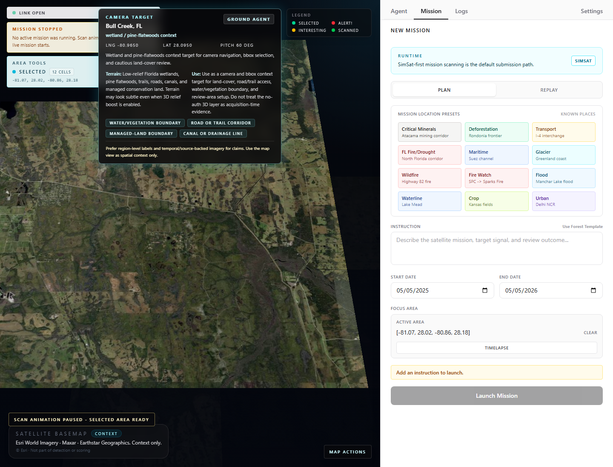

Camera moves are not just coordinates. Known targets such as Bull Creek, FL carry location type, terrain context, mission use, suggested evidence targets, and safe evidence guidance so the map jump becomes a review-ready location context.

## Architecture In 60 Seconds

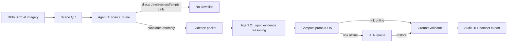
```mermaid
flowchart LR
  A[DPhi SimSat imagery] --> B[Scene QC]
  B --> C[Agent 1: scan + prune]
  C -->|discard noise/cloud/empty cells| D[No downlink]
  C -->|candidate anomaly| E[Evidence packet]
  E --> F[Agent 2: Liquid evidence reasoning]
  F --> G[Compact proof JSON]
  G -->|link online| H[Ground Validator]
  G -->|link offline| Q[DTN queue]
  Q -->|restore| H
  H --> I[Audit UI + dataset export]
```

Current runtime: SimSat-first imagery lane, deterministic replay fixtures for repeatable demos, and Liquid evidence-packet reasoning when a manifest-resolved local model runtime is available. NM-UNI training proof is surfaced from `training_result_manifest.json`; production image-conditioned inference is not claimed unless `mmproj` or native VLM runtime support is present and wired.

## Validation Snapshot

| Check | Current State |
|---|---|
| Root verify | `.\run.ps1 -Verify` and `./run.sh --verify` passing |
| Backend tests | `427 passed` |
| Frontend | typecheck + build passing |
| Playwright E2E | `98 passed`, `1 skipped` |
| Recorded demos | showcase, object evidence, payload, provenance, abstain, eclipse |
| Dataset export | `200` samples, `11` replay-cache rows, `185` mission metadata rows, `15` timelapse rows |
| Retagged training set | `163` assets, `15` temporal sequences |
| Dataset | [Shoozes/LFM-Orbit-SatData](https://huggingface.co/datasets/Shoozes/LFM-Orbit-SatData) |
| Trained model | [Shoozes/lfm2.5-450m-vl-orbit-satellite](https://huggingface.co/Shoozes/lfm2.5-450m-vl-orbit-satellite) |

## Model And Dataset Handoff

Pull the trained Orbit GGUF bundle into `runtime-data/models/lfm2.5-vlm-450m/`:

```powershell
.\run.ps1 -Install -FetchModel
```

```bash
./run.sh --install --fetch-model
```

This writes `model_manifest.json`, preserves `orbit_model_handoff.json` as `source_handoff.json`, and stores `training_result_manifest.json`. Orbit exposes the distinction as:

```text
Training modality: image-text SFT in the fetched handoff
Runtime mode: text evidence-packet reasoning
Direct image inference: unavailable until mmproj/native VLM runtime is present
```

The launchers install the optional `llama-cpp-python` runtime when supported; Linux/WSL hosts without compiler support still complete the core install and boot safely.

Dataset export, retagging, and Hugging Face upload details live in [docs/DATASET_CYCLE_TUTORIAL.md](docs/DATASET_CYCLE_TUTORIAL.md).

## Run Locally

```powershell
.\run.ps1 -Install
.\run.ps1 -Run
```

```bash
./run.sh --install
./run.sh --run
```

App: `http://127.0.0.1:5173`

API: `http://127.0.0.1:8000`

## Limits

- This is a demo-ready research prototype, not unattended production autonomy.
- Scope is locked to stability fixes, small visual polish, and sharper SAT/GND/CV/LFM response wording.
- DPhi SimSat scoring is truthfully labeled `proxy_bands`.
- Multispectral claims are limited to direct/replay metadata lanes such as ice/snow NDSI with SCL rejection and persistence.
- Fallback paths must stay labeled as fallback and must not become high-confidence detections.

## Docs

| Doc | Purpose |
|---|---|
| [docs/README.md](docs/README.md) | Compact docs index |
| [docs/DEMO_GUIDE.md](docs/DEMO_GUIDE.md) | Demo commands, artifacts, and replay assets |
| [docs/ARCHITECTURE.md](docs/ARCHITECTURE.md) | Runtime map and design notes |
| [docs/OBJECT_EVIDENCE_MODE.md](docs/OBJECT_EVIDENCE_MODE.md) | Target-pack proof contracts, safety scope, and current UI boundaries |
| [docs/DATASET_CYCLE_TUTORIAL.md](docs/DATASET_CYCLE_TUTORIAL.md) | Seed, export, retag, and Hugging Face cycle |
| [docs/MODEL_HANDOFF.md](docs/MODEL_HANDOFF.md) | Model bundle and dataset handoff contract |
| [docs/FUTURE_SENTINEL_LANES.md](docs/FUTURE_SENTINEL_LANES.md) | Post-handoff Sentinel lane boundaries |
| [docs/TODO.md](docs/TODO.md) | Compact active backlog and verification checklist |

## Usage To Training Loop

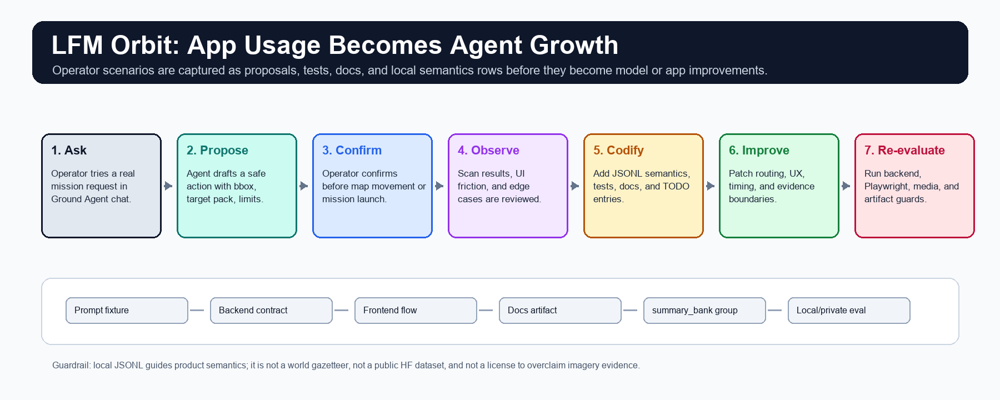

Operator prompts become product feedback: semantics rows, backend contracts, browser flows, docs, TODO entries, summary-bank groups, and future model training candidates. The repeatable method lives in [docs/AGENT_GROWTH_LOOP.md](docs/AGENT_GROWTH_LOOP.md).
