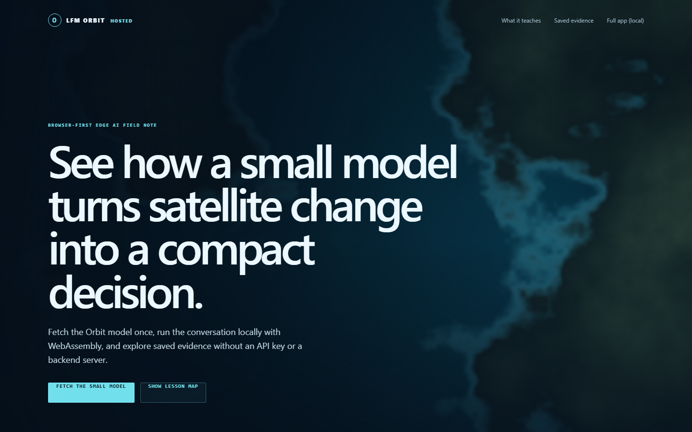
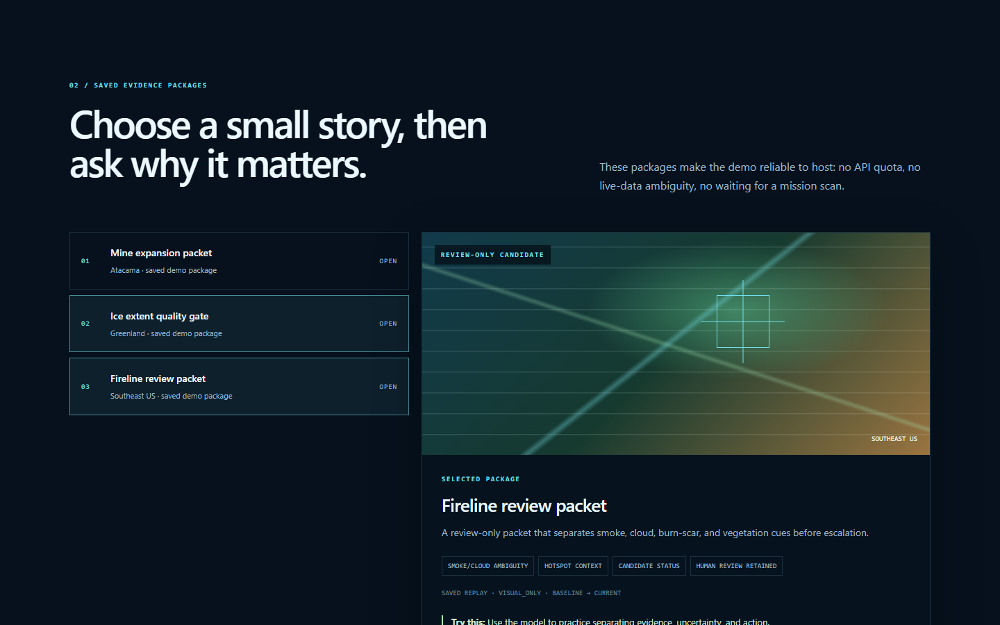

# LFM-ORBIT

LFM-ORBIT is a professional-product-style MVP for satellite evidence triage. It is not a production surveillance system; it is a reproducible mission-control prototype showing how local Liquid AI reasoning can reduce satellite downlink load, retain only useful evidence, and produce compact proof packets with provenance. GenUni is the separate training-cycle/producer repository; it is not the LFM-ORBIT application repository.

The product journey is simple: an operator selects a mission area, Orbit scans satellite tiles, low-value cells are pruned before downlink, retained evidence is reviewed by SAT/GND agents, and the final output is compact proof JSON with imagery provenance.

[Hosted browser demo](docs/user/HOSTED_DEMO.md) | [Demo guide](docs/user/DEMO_GUIDE.md) | [Validation](#validation-snapshot) | [LFM-ORBIT on GitHub](https://github.com/Shoozes/LFM-ORBIT) | [Repository boundary](docs/dev/REPOSITORY_BOUNDARY.md)


## Run The App

For the lightweight portfolio presentation, start the browser-only hosted route:

```powershell
.\run.ps1 -Hosted
```

```bash
./run.sh --hosted
```

Open `http://127.0.0.1:5173/hosted`. It loads a validated saved-package manifest and starts the pinned small browser-model fetch only when the visitor chooses it. The current browser path performs text reasoning over saved evidence; it is not image-conditioned VLM inference. It does not require the backend, provider credentials, or an Orbit API. See the [hosted demo handoff](docs/user/HOSTED_DEMO.md).

```powershell
.\run.ps1
```

Choose **1. Install/Repair + Fetch trained Orbit GGUF -> Run**.

Direct Windows command:

```powershell
.\run.ps1 -Install
```

Linux/macOS:

```bash
./run.sh --install
```

App: `http://127.0.0.1:5173`

The default full-app path uses SimSat/Mapbox plus bundled cached replay proof. Sentinel Hub credentials are not required.

Option 1 reuses an existing valid trained GGUF after the first download. Set `LFM_ORBIT_REFRESH_MODEL=true` only when you intentionally want to refresh the moving Hugging Face `main` handoff.

## Mission Stories

Orbit is not a single canned demo. The app ships with several reviewable mission stories so an operator can pick the signal that best explains the product loop:

| Story | What To Look For | Best Use |
|---|---|---|
| Critical Minerals Expansion Watch | evaporation pond regions, tailings regions, open-pit expansion, roads, facility clusters | clearest main showcase and provenance proof |
| Deforestation / Rondonia Frontier | canopy-loss boundary, road-edge expansion, exposed soil, retained timelapse frames | end-to-end tutorial from chat-launched mission to proof JSON |
| Fire Watch / Wildfire | burn-scar, smoke/cloud ambiguity, fireline or readiness indicators | emergency-relevance story with cautious evidence wording |
| Flood / Waterline | new surface water, overflow regions, shoreline movement | payload-reduction and visible boundary-change story |
| Maritime Activity | vessel-queue or port activity regions, link outage queueing | orbital-eclipse and compact-packet queue proof |
| Glacier / Ice-Snow | snow/ice extent, spectral-confidence guardrails, sequential timelapse context | slower science-context and abstain-safety story |
| Urban / Lifeline / Transport | road corridors, facility regions, infrastructure context | secondary operator-planning and map-context stories |

The recommended public showcase is still **Critical Minerals Expansion Watch** because it is visually clear and source-bound. The other stories use the same app mechanics: select an area, scan or rescan cached evidence, let SAT/GND agents review retained packets, then open Proof Mode.

## Reviewer Path

1. Open **Mission**.
2. Choose **Replay**.
3. Load **Critical Minerals Expansion Watch** for the shortest proof path, or choose another mission story such as **Deforestation**, **Fire Watch**, **Flood**, **Maritime**, **Glacier**, or **Urban**.
4. Review **Logs** and **Inspect** for the downlinked alert, retained timelapse, source metadata, and agent notes.
5. Open **Agent -> Proof Mode** for the compact proof JSON and visual evidence.

For judging, one complete mission is enough. The extra stories are there to show the product is a reusable mission-control prototype, not a rigid one-off recording.

## Record The Showcase

```bash
cd source/frontend
npm ci
npm run demo:showcase
```

The showcase loads deterministic Critical Minerals Expansion Watch replay evidence and writes video, screenshot, trace, and `proof.json` artifacts. No Sentinel Hub credentials are needed for the showcase path.

## Watch The Main Videos

The primary videos are linked instead of embedded because they are larger tutorial artifacts:

- [Tutorial walkthrough](docs/media/videos/tutorial_video.webm): plain-English product run-through from mission selection to scan, SAT/GND handoff, retained evidence, Proof Mode, compact JSON, and tagged data.
- [Training journey](docs/media/videos/training-journey.webm): shows how reviewed Orbit evidence becomes reusable training data.
- [Media index](docs/media/README.md): all promoted videos, screenshots, story plates, and timelapse highlights.

Full repo verification:

```powershell
.\run.ps1 -Verify
```

```bash
./run.sh --verify
```

## What It Proves

- Tile scan over selected area and time window.
- Dual-agent triage: satellite-side prune, ground-side review.
- Retained timelapse evidence with provenance.
- Optional LiquidAI/LFM2.5-VL-450M retained-frame review when the image runtime is enabled.
- Compact proof JSON instead of raw-image downlink.
- Saved and tagged evidence for export, retagging, tuning, replay, and cached-data rescan with newer prompts or models.

The portfolio artifact is treated like a product contract: install path, deterministic demo, source-backed evidence, proof output, and honest runtime boundaries.

## Proof Gallery

### 01. Critical Minerals Expansion Watch


Region-level mining expansion evidence with provenance, target-pack context, and compact proof output.

### 02. Payload Reduction


Raw frame evidence is reduced to compact alert JSON before downlink.

### 03. Orbital Eclipse Queue


Alerts queue during link loss and flush after contact returns.

### 04. Target-Pack Proof


Target-pack metadata travels with alerts, replay snapshots, dataset rows, and Proof Mode.

### 05. Provenance And Audit


Each alert keeps provider, capture time, bbox, confidence, model metadata, and payload accounting attached.

### 06. Timelapse Context


Timelapse review uses sequential imagery slices, not static color-shift videos.

### 07. Ground Operations


Ground Agent handles replay loads, mission packs, link simulation, and operator review cards before state changes.

### 08. Semantic Location Context


Known map targets carry mission context and safe evidence guidance with the camera move.

### 09. Hosted Browser Presentation



The separate hosted route presents saved evidence packages and local browser inference without backend controls.

[Hosted browser demo video](docs/media/videos/hosted-demo.webm) shows the static route, saved-package provenance, and local-model boundary without starting the backend.

### 10. Hosted Evidence Package



The hosted package view keeps the data boundary visible: saved demo evidence is not live imagery.

## Validation Snapshot

The table below separates the historical May 8 release snapshot from the current August 4 integrity pass. The current backend suite and hosted frontend route have been rerun locally; the production GGUF launcher path remains a separate heavyweight verification lane.

| Check | Current State |
|---|---|
| Root verify | August 4 `.\run.ps1 -Verify` passed; the optional trained-GGUF runtime smoke remains a separate lane |
| Backend tests | August 4 full backend suite `554 passed` |
| Frontend | typecheck + production build passing; hosted smoke, static preview, and production-preview model proof passing |
| Pages project path | Pages-mode production build and `/LFM-ORBIT/` static smoke passing locally; live deployment proof remains separate |
| Hosted real-model proof | `npm run test:hosted:model:build` fetched the pinned 219 MB GGUF and generated a local response with no backend/API/WebSocket requests |
| Playwright E2E | August 4 default suite rerun: `108 passed, 6 skipped` with intentional skips; Pages-only release specs are excluded from this default port-owning suite |
| Docs/import guards | passing |
| Option 1 launch | backend `8000` and app `5173` ready |
| Clean-start smoke | idle on Atacama context, no auto replay, no default scan |
| Recorded demos | showcase, tutorial, training journey, payload, provenance, abstain, eclipse |
| Dataset export | `46` raw replay/cache samples, `34` timelapse rows |
| Retagged training set | `265` assets, `33` temporal sequences |
| Dataset | [Shoozes/LFM-Orbit-SatData](https://huggingface.co/datasets/Shoozes/LFM-Orbit-SatData) |
| Trained model | [Shoozes/lfm2.5-450m-vl-orbit-satellite](https://huggingface.co/Shoozes/lfm2.5-450m-vl-orbit-satellite) |

## Model + Training Loop

LFM-ORBIT uses a manifest-resolved GGUF for SAT/GND evidence-packet reasoning. Optional retained-frame image review uses LiquidAI/LFM2.5-VL-450M through the backend `vision` extra when enabled.

The status APIs report `image_conditioned_runtime_enabled=true` only after a real image adapter call succeeds.

Orbit exports reviewed evidence for retagging and tuning. The updated model handoff can be fetched back into Orbit and used to replay or rescan prior sessions.

## Requirements

Python `3.10+` and Node.js `20.19.0` from `.nvmrc` or Node.js `22.12.0+`. The launchers bootstrap repo-local `uv` when it is not already installed.

## Docs

- [Demo Videos and Other Media](https://github.com/Shoozes/LFM-ORBIT/tree/main/docs/media)
- [Docs index](docs/README.md)
- [Demo guide](docs/user/DEMO_GUIDE.md)
- [Architecture](docs/dev/ARCHITECTURE.md)
- [Model handoff](docs/dev/MODEL_HANDOFF.md)
- [Dataset cycle](docs/dev/DATASET_CYCLE_TUTORIAL.md)
- [Current backlog](docs/dev/TODO.md)
- [Current integrity review](docs/dev/review.md)
