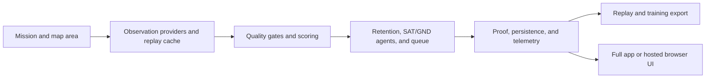

# LFM Orbit Architecture

Owner: maintainers of the application boundary and runtime contracts. This document explains stable boundaries and data flow; the active backlog is [TODO.md](TODO.md), and changing release evidence belongs in the root [README](../../README.md).

## System shape



Orbit is a mission-control prototype. It turns a selected area and time window into provenance-rich evidence packets, retains only useful candidates, and exposes an auditable proof surface. It is not a production surveillance system and does not turn proxy imagery into confirmed real-world claims.

## Runtime modes

| Mode | Boundary | Data and model behavior |
| --- | --- | --- |
| Full local app | FastAPI plus React | SimSat/replay observations, SQLite runtime state, SAT/GND coordination, optional local GGUF. |
| Hosted local | React at `/hosted` | Saved demo packages, browser-local text reasoning when selected, no backend or provider credentials. |
| GitHub Pages | React at the configured project path | Model-free saved packages by default; the workflow emits no model manifest, Wllama runtime, or weights. |
| Model-enabled hosted | Explicit `VITE_HOSTED_MODEL_ENABLED=true` | HTTPS browser model lane only; manifest identity and licensing must be approved before public promotion. |

## Six-stage data flow

1. **Mission** — the operator selects a preset or map area, objective, date range, and scan policy. A confirmed mission owns its producer and prevents stale demo URLs or boot scans from taking over.
2. **Observation** — the selected provider or Replay Cache returns bounded imagery/context. Offline and replay paths preserve source, capture time, area, and acquisition identity.
3. **Quality and scoring** — cloud, temporal, coverage, safety, and target-pack rules classify candidates. Degenerate boxes and unsafe labels are rejected before persistence.
4. **Retention and reasoning** — retained evidence is reviewed by SAT/GND agents, queued when the link is unavailable, and deduplicated by mission/cell/acquisition identity.
5. **Proof and persistence** — alerts, replay snapshots, gallery evidence, telemetry, and model metadata share the same provenance fields. Candidate wording remains weaker than externally validated confirmation.
6. **Replay and training export** — completed evidence can be loaded from the Replay Cache, compared additively with current model metadata, and exported as valid evidence-packet or image/text training rows.

## Ownership boundaries

| Directory | Owns |
| --- | --- |
| `source/backend/api/` | HTTP/WebSocket routes, request limits, status, and lifecycle wiring. |
| `source/backend/core/` | Mission, provider, scoring, agent, persistence, replay, and export contracts. |
| `source/backend/scripts/` | Explicit maintenance, model, dataset, and verification commands. |
| `source/frontend/components/` | Full-app interaction surfaces and user-visible state. |
| `source/frontend/hosted/` | Hosted packages, model policy, browser model state, and hosted presentation. |
| `source/frontend/hooks/` and `utils/` | Async transport, cancellation, bounded refresh, and shared browser contracts. |
| `source/frontend/e2e/` | Functional browser checks and release-only hosted/media checks under explicit configs. |

The frontend should consume API contracts and typed state; it must not become a second provider or persistence implementation. Hosted code should stay backend-free and use local, validated package paths.

## Storage and contract boundaries

- Mutable runtime databases and caches live under `runtime-data/`; source-backed fixtures and replay manifests live under `source/backend/assets/`.
- Browser hosted packages are versioned JSON plus local assets under `source/frontend/public/`. Package provenance names a replay and a repo-relative source asset.
- WebSocket clients validate envelopes, ignore unknown or unsafe messages, bound history, time out refreshes, and use capped reconnect backoff. A closed or stale socket cannot repaint a newer state.
- Exported rows carry `runtime_truth_mode`, `imagery_origin`, scoring basis, provenance, and optional `visual_model_review`. A missing optional visual review does not invalidate an evidence-packet row.
- Replay Cache comparisons are additive. A cached rescan preserves the original replay proof and records `cached_rescan_current_model` for the new scoring basis.

## Model boundary

The trained Orbit GGUF currently reasons over text evidence packets. Image-conditioned retained-frame review is a separate, opt-in adapter and is only claimed when `/api/analysis/status` reports `image_conditioned_runtime_enabled=true`. The hosted browser manifest is pinned and validated; Pages remains model-free until redistribution and attribution are approved. See [MODEL_HANDOFF.md](MODEL_HANDOFF.md) and [third-party notices](../legal/THIRD_PARTY_NOTICES.md).

## Truth and safety invariants

- Candidate, proxy-only, replay, and fixture evidence is labeled as such; no UI or export silently upgrades it to a confirmed incident.
- Critical minerals, coastal debris, HAB, wildfire, protected-wildlife, and lifeline outputs retain their domain-specific caution wording.
- Link-offline alerts queue compact JSON and flush only after recovery. Empty grids do not start telemetry scoring.
- Mission replacement, reload, stop, and camera-only navigation leave the visible scan/replay state explicit and recoverable.
- Basemap failure is visible but never changes scoring or provenance.

## Verification

Run from the owning package unless noted:

```powershell
cd source/frontend
npm run lint
npm run test:unit
npm run build
npm run verify:hosted
npm run test:e2e
```

```powershell
cd source/backend
uv run --no-sync pytest -q
```

CI keeps hosted production smoke, application E2E, media production, dependency reports, workflow syntax, and docs/context checks as separate contracts so a slow artifact does not hide an application failure.
