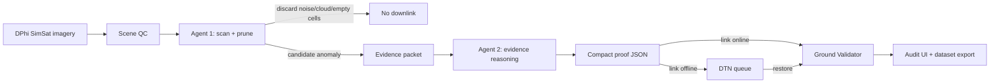

# LFM Orbit Architecture

Current as of **August 4, 2026**.

## System Shape

LFM Orbit has two presentations: the full operator app at `/`, backed by FastAPI, and a separate browser-only portfolio route. The normal build exposes the hosted route at `/hosted`; `npm run build:hosted` emits the hosted presentation at `/` without the full app, while `npm run build:pages` emits the same bundle under a configurable Pages project base. The full frontend is organized around five operator surfaces plus one replay proof surface:

- `Mission`: define bbox, task text, and temporal window.
- `Agents`: inspect the SAT/GND dialogue bus and interact with the ground assistant.
- `Logs`: review flagged examples and persisted alerts.
- `Inspect`: inspect a selected cell's temporal evidence, overlays, imagery, and analysis.
- `Settings`: inspect provider status, credentials, local-model state, and optional depth support.
- `Proof Mode`: self-playing replay proof surface activated by `?demo=1` and recorded by a separate Playwright demo config.

The backend can run two optional long-lived agent loops during app lifespan, while live telemetry uses one mission-owned scan producer for all WebSocket consumers:

- `core/satellite_agent.py`: orbital scan loop, provider fetch, QC gate, scoring, telemetry emission.
- `core/ground_agent.py`: message-bus listener, confirmation, gallery/timelapse enrichment, operator-facing validation.

`core/scan_coordinator.py` owns the mission-owned producer, telemetry WebSocket fan-out, and mission-scoped scan lease. It keeps one producer task per event loop, bounds each subscriber queue, replays the latest state to a newly connected browser, survives zero viewers while a live mission is active, and prevents the optional SAT-agent engine from scoring the same live mission concurrently. `ORBIT_LIVE_SCAN_ENGINE` and `RUN_AGENT_PAIR_ON_BOOT` select the producer explicitly.

## End-to-End Flow

1. `MissionControl.tsx` posts mission state to `/api/mission/start` and exposes one-click maritime/lifeline monitor preview cards.
2. `api/main.py` starts the mission-owned telemetry supervisor, optionally boots `run_satellite_agent()` and `run_ground_agent()` during lifespan, and exposes REST/WebSocket endpoints; `/ws/telemetry` routes all browser consumers through the shared scan coordinator.
3. `core/runtime_state.py` centralizes deterministic store initialization/reset so replay loading, backend tests, and Playwright demos all reset the same runtime surfaces.
4. `core/temporal_use_cases.py` auto-classifies the mission into a temporal use case such as deforestation, wildfire, civilian lifeline disruption, maritime activity, ice/snow extent, or legacy ice-cap visual review.
5. `core/lifeline_monitoring.py` validates before/after candidate schemas, preserves baseline/current frame metadata, and decides `discard`, `defer`, or `downlink_now` only after frame-pair integrity gates pass.
6. `core/maritime_monitoring.py` adds deterministic maritime monitor reports, optional Element84 STAC metadata search, and N/E/S/W investigation planning.
7. `core/grid.py` validates operator bboxes/cell IDs and generates the active square-grid scan geometry.
8. `core/depth_anything.py` exposes optional Depth Anything V3 status, runtime toggling, and compact depth-summary inference without making DA3 a required dependency.
9. `core/loader.py` resolves observations from the configured provider chain, with DPhi SimSat as the default path, and caches by provider plus date-window labels.
10. `core/paths.py` centralizes repo-root runtime-data/model/boundary paths so cache and model resolution do not drift with working directory.
11. `core/model_manifest.py` resolves the trained satellite artifact from a runtime manifest plus environment overrides.
12. `core/object_targets.py` loads versioned default target packs plus runtime custom packs, normalizes object targets, rejects unsafe labels, and backs the `/api/object-targets/*` registry routes.
13. `core/mission.py` stores mission-level `target_pack_id`, `object_targets`, and an optional `confirmation_policy`, exposes add/remove/set/clear mutation helpers, and keeps old mission rows migration-safe. Unspecified policy falls back to the conservative region default; one-shot callers can explicitly request `single_acquisition`.
14. `core/object_evidence.py` runs enabled mission targets through batch grounding, normalizes boxes to `unit_xyxy`, summarizes counts, and preserves provenance.
15. `core/mission_archive.py` preserves mission intent before runtime resets and feeds dataset exports with target packs/object targets without new provider calls.
16. `core/scene_qc.py` rejects unusable scenes before scoring.
17. `core/scorer.py` and `core/analyzer.py` compute deltas, confidence, and interpretation signals.
18. `core/overlays/attribution.py` adds governance/boundary context when available.
19. `core/telemetry.py` emits typed `scan_result` payloads defined in `core/contracts.py`.
20. `core/queue.py` persists confirmed alerts for `Logs`, `Inspect`, and recent-alert APIs. Alert rows retain mission/use-case/target-pack identity, while anomaly candidates are keyed by mission and cell so streaks cannot leak across missions.
21. `core/gallery.py` expands confirmed alerts into imagery/timelapse evidence, selects the retained image passed to visual review, and reuses local replay cache imagery for thumbnail fallback before dropping to offline chips; dataset export rasterizes SVG fallbacks to PNG.
22. `core/replay.py` can reset runtime state and load a completed mission directly into the same mission, queue, gallery, metrics, and dialogue stores used by realtime operations. `core/replay_snapshot.py` preserves and validates mission confirmation policy during round-trip restore. Replay also exposes cached API WebMs as Replay Cache entries and can rescan the same retained frames/evidence through the current prompt/model review stack without provider fetches.
23. `ValidationPanel.tsx` and `TimelapseViewer.tsx` expand a selected alert into imagery, analysis, exports, and timelapse context. Mission-tab timelapse output stays separate from mission setup so active temporal video evidence remains visible.
24. `SettingsPanel.tsx` queries provider, SimSat, analysis, and depth status endpoints independently, with short retries so one transient miss does not force a false offline settings surface.
25. `GroundAgent.tsx`, `/api/agent/chat`, and `/api/agent/action/confirm` provide a local action chat that proposes and confirms replay loads/rescans, mission packs, SAT/GND link changes, and map-navigation actions before mutating app state.
26. `ProofModePanel.tsx` turns replay state into visible Proof Mode output: satellite frame, bbox/evidence overlay, evidence result, image-conditioned retained-frame review status when enabled, latency, provenance, raw-vs-alert bytes, reduction ratio, abstain state, backend-derived link outage queue, and proof JSON. Its async hydration is keyed to mission identity and snapshots high-churn telemetry inputs so live mission refreshes do not cancel an in-flight related-timelapse request.
27. `source/frontend/hosted/HostedDemo.tsx` is a static presentation surface with a validated `source/frontend/public/demo-packages/index.json` manifest and local browser tutoring; reviewed stills live under `source/frontend/public/demo-assets/`. `hostedConfig.ts` owns the project-base-aware asset resolver, `hostedModel.ts` validates the sealed browser model manifest, and `useBrowserModel.ts` reads its identity on route entry, verifies the pinned Hugging Face pointer/byte inventory only after an explicit fetch, and keeps download cancellation separate from reusable-instance generation cancellation before Wllama/WebAssembly loads it. `TerrainShaderCanvas.tsx` supplies the HAIO-inspired landing visual and pauses when motion/visibility conditions require it.

## Module Map

### Backend Runtime

- `source/backend/api/main.py`
  FastAPI entrypoint, lifespan boot, REST endpoints, telemetry websocket, agent-dialogue websocket.
- `source/backend/core/config.py`
  Region selection, provider ordering, thresholds, runtime summaries.
- `source/backend/core/contracts.py`
  Typed wire contracts shared across telemetry, alert persistence, object evidence, tests, and frontend normalization.
- `source/backend/core/object_targets.py`
  Object target pack registry. It loads default and runtime custom packs, normalizes target labels/prompts/classes, rejects unsafe target labels, saves/deletes custom packs, and keeps defaults read-only.
- `source/backend/core/object_evidence.py`
  Batch object-evidence adapter around visual grounding. It skips disabled targets, clamps boxes, emits semantic colors, summarizes counts, and carries provenance for compact proof plumbing.
- `source/backend/core/mission_archive.py`
  Append-only mission metadata archive used before runtime resets. It keeps task text, bbox, target packs, and object targets available for dataset export and future model-training cycles without refetching imagery.
- `source/backend/core/scanner.py`
  Scan orchestration and anomaly-confirmation gating. It stays idle with an empty grid when no active mission exists, resumes active missions from persisted progress, applies the persisted per-mission confirmation override or conservative region default, and filters proxy-only firewatch vegetation changes before they become alert pins. Its mission-owned service and browser consumers use `scan_coordinator.py`.
- `source/backend/core/scan_coordinator.py`
  Mission-owned single-producer lifecycle plus bounded fan-out for telemetry WebSocket clients. It prevents multiple browser tabs from running independent scoring loops, keeps active missions running without viewers, and drops only stale updates for saturated consumers.
- `source/backend/core/grid.py`
  Current scan-cell compatibility layer, bbox validation, cell-id validation, and scan-grid generation.
- `source/backend/core/loader.py`
  Provider resolution, SimSat Sentinel/Mapbox loading, window loading, cache keys, and fallbacks. SimSat health checks are cached briefly so unavailable local SimSat does not stall development fallback scans.
- `source/backend/core/scene_qc.py`
  Valid-pixel and no-data rejection gate.
- `source/backend/core/scorer.py`
  Spectral-delta scoring and reason-code generation.
- `source/backend/core/analyzer.py`
  Mission-aware interpretation over scored packets. Firewatch can screen fuel-stress context, but proxy-only vegetation signals remain candidate/no-downlink until source-backed smoke, active-fire, burn-scar, hotspot, or fireline evidence appears.
- `source/backend/core/indices.py`
  Derived spectral index helpers, including Sentinel-2 NBR/NDMI/dNBR and visible-band smoke/cloud assist features.
- `source/backend/core/wildfire_smoke.py`
  Wildfire Confidence Assist scoring for source-backed Sentinel-2 frames. It combines cloud/SCL guardrails, blue/green smoke cues, NBR/dNBR/NDMI burn context, optional hotspot support, temporal persistence, and proxy-source confidence caps so white smoke/cloud ambiguity becomes `defer` or `review` instead of unsupported fire confirmation.
- `source/backend/core/overlays/attribution.py`
  Boundary/governance overlap context.
- `source/backend/core/observability.py`
  Runtime observer, structured production logging, throttled warning summaries, and latency/rejection metrics.
- `source/backend/core/queue.py`
  Alert persistence and recent-alert retrieval, including compact object-evidence and optional image-conditioned `visual_model_review` payloads. SQLite defaults resolve through `core/paths.py`; broadcast bus receipts and mission-scoped candidate state are separate contracts.
- `source/backend/core/metrics.py`
  Aggregated counters, flagged examples, observability rollups, rejection-reason counts, and low-valid-coverage rates surfaced in Logs and decision-gate output.
- `source/backend/core/paths.py`
  Repo-root runtime path helpers for cache DBs, metrics, boundaries, local models, observation records, timelapse cache, and monitor reports. Mutable stores should use these helpers; committed seeded assets remain read-only inputs.
- `source/backend/core/model_manifest.py`
  Runtime model-manifest resolution for trained satellite artifacts, local/Hugging Face handoff metadata, and LiquidAI Leap Tune-compatible training-manifest proof fields.
- `source/backend/core/inference.py`
  GGUF text/evidence-packet inference path plus runtime capability status for the local satellite model. Satellite prompts derive mission category/task/signals/methods from the temporal use-case contract.
- `source/backend/core/multimodal_inference.py`
  Runtime-gated image review adapter. It reports feature flags, backend selection, `mmproj`/checkpoint readiness, shares bounded image-payload decoding, returns structured unavailable or blank-image abstain payloads, and only reports image-conditioned review enabled after a real adapter has loaded.
- `source/backend/core/image_payload.py`
  Shared base64, decoded-byte, data-URL, and input-length limits used by image review and optional depth inference.
- `source/backend/core/depth_anything.py`
  Optional Depth Anything V3 adapter, `/api/depth/*` status/toggle support, package detection, and compact depth-map statistics.
- `source/backend/core/mission.py`
  Mission lifecycle and operator-run state, including `live` vs `replay` mission modes, auto-selected temporal use-case metadata, `target_pack_id`, and normalized `object_targets`.
- `source/backend/core/temporal_use_cases.py`
  Temporal use-case catalog, examples, classifier, API-prep plan builder, and chat-style training JSONL row builder with provenance and visual-review metadata passthrough.
- `source/backend/core/lifeline_monitoring.py`
  Civilian lifeline before/after candidate validation, frame-pair preservation, distinct-frame downlink gating, eval metrics, and acceptance checks.
- `source/backend/core/maritime_monitoring.py`
  Orbit-native maritime monitor report, optional Element84 Sentinel-2 STAC metadata search, and cardinal investigation planning.
- `source/backend/core/ice_snow_monitoring.py`
  Sentinel-2 L2A ice/snow extent scoring helpers. They compute NDSI, use SCL cloud/shadow/no-data rejection, preserve snow/ice SCL support, flag water/ice ambiguity, and require multi-frame persistence.
- `source/backend/core/runtime_state.py`
  Deterministic runtime initialization/reset helper used by app boot, replay loading, and automated validation.
- `source/backend/core/agent_bus.py`
  SAT/GND/operator message queue, pins, replay-safe read-state helpers, and targeted message-id read marking for DTN proof flushes. Broadcast messages use independent ground/satellite receipts instead of a single global read bit.
- `source/backend/core/sqlite.py`
  Shared commit/rollback/close context for the runtime SQLite stores and debug dashboard.
- `source/backend/core/gallery.py`
  Ground-confirmed imagery/timelapse evidence store and retained visual-review image selector.
- `source/backend/core/replay.py`
  Replay catalog/loading path that hydrates the existing runtime tables for showcase walkthroughs and fixture-driven demos, dynamically catalogs valid cached API WebMs, and starts realtime rescans from replay metadata.
- `source/backend/core/replay_snapshot.py`
  Portable runtime snapshot export/import for completed missions. It validates shape, row bounds, numeric finiteness, and payload ranges before reset, then packages mission, object targets, alert, visual-review, gallery, pin, dialogue, and metrics surfaces without changing the bundled replay manifest format.
- `source/backend/core/monitor_reports.py`
  Runtime persistence helper for API-generated maritime and lifeline monitor reports under `runtime-data/monitor-reports/`.
- `source/backend/core/timelapse.py`
  Temporal frame generation and video assembly; `steps` caps provider frame fetches for long windows, generated cache keys include effective months, bbox, and provider preference, generated files live under runtime-data, and committed legacy keys remain explicit seeded replay readers.
- `source/backend/core/vlm.py`
  Mission-evidence grounding helper with deterministic offline fallbacks; imagery fetch failures fall back instead of sending blank tiles into optional pipelines.
- `source/backend/scripts/decision_gate.py`
  Local pipeline readiness report for scan counts, stage failures, QC rejection breakdowns, and optical/SAR readiness recommendations.
- `source/backend/scripts/fetch_satellite_model.py`
  Fetch utility that stages a published artifact into `runtime-data/models/` and writes the local runtime manifest.
- `source/backend/scripts/export_orbit_dataset.py`
  Dataset exporter for recent alerts, image-conditioned visual reviews, fetched/cached API imagery, local gallery evidence, weak reject controls, cached API observations, direct replay-cache rows, persisted maritime/lifeline monitor reports, current/archived mission metadata, enriched sample JSONL, and SFT-style training JSONL.
- `source/backend/scripts/retag_training_assets.py`
  Standalone second-pass retagger for exported data directories. It deduplicates images/frames by SHA-256, extracts sampled timelapse frames, writes ordered temporal sequence JSONL, and can use heuristic/manual queue, Ollama vision, or OpenAI-compatible vision providers.
- `source/backend/scripts/retag_training_assets_ui.py`
  Optional Tkinter wrapper around the retag CLI for operators who prefer directory pickers, a live subprocess log, and optional Hugging Face dataset upload after a successful retag pass.
- `source/backend/scripts/upload_orbit_dataset_hf.py`
  Hugging Face dataset upload helper for exported or retagged dataset folders. It resolves `HF_TOKEN`, `HUGGINGFACE_HUB_TOKEN`, or a local developer token file without printing token values.
- `source/backend/scripts/evaluate_model.py`
  Eval harness that replays exported samples through the offline analyzer, writes `orbit_eval_v2` artifacts, compares baseline vs candidate summaries, and emits promotion decisions.
- `source/backend/scripts/smoke_satellite_model.py`
  Model-present smoke path for manifest-resolved GGUF artifacts. Missing models skip by default and fail only with `--require-present`.
- `source/backend/scripts/seed_sentinel_cache.py`
  Optional development-only Sentinel Hub cache seeder for high-quality replay/dataset timelapses. It is not required for the hosted showcase path, which is built around saved packages; the full app uses DPhi SimSat plus bundled replay fixtures.
- `source/backend/satellite_debug.py`
  Separate port-8080 debugging surface for the agent bus.
- `source/backend/autonomous_agent.py`
  Retired standalone prototype shim. The supported runtime is the FastAPI dual-agent app.

### Frontend Runtime

- `source/frontend/hosted/HostedDemo.tsx`, `source/frontend/hosted/hosted.css`
  Separate portfolio presentation for saved evidence, browser model fetch, local chat, and short edge-AI lessons. It deliberately has no backend/provider/API controls.
- `source/frontend/playwright.hosted.config.ts`, `source/frontend/playwright.hosted.build.config.ts`
  Frontend-only hosted smoke paths. They verify manifest contracts in Vite development and the isolated static preview without FastAPI or the backend model runtime.

- `source/frontend/App.tsx`
  Shell layout, tab routing, top-level polling, map/sidebar coordination, mobile Chat/Map shell switching, and map-driven agent-evaluation error routing.
- `source/frontend/hooks/useTelemetry.ts`
  Grid, alerts, selected cell, mission completion, websocket lifecycle, and abort/sequence guards that prevent superseded refreshes from repainting stale state.
- `source/frontend/components/MapVisualizer.tsx`
  MapLibre basemap, scan grid, pins, bbox preview, context menu, retained proof boxes when alerts/replays carry them, scan progress hints, safe marker-label rendering, basemap degradation notices, and map-pin sync failure visibility.
- `source/frontend/utils/objectEvidence.ts`
  Shared semantic object-evidence colors plus normalized bbox conversion used by MapLibre overlays.
- `source/frontend/components/MissionControl.tsx`
  Mission entry form, preset selection, Replay Cache loader/rescan controls, temporal windows, bbox controls, stop/launch state.
- `source/frontend/components/SettingsPanel.tsx`
  Independent provider/SimSat/model/depth status fetches with retry, trimmed credential validation, optional Depth Anything V3 toggle, and runtime health surface.
- `source/frontend/e2e/testUrls.ts`
  Shared CI/dev Playwright loopback URL helpers so test ports can be overridden without rewriting specs.
- `source/frontend/e2e/runtime.ts`
  Shared retryable app navigation, runtime-reset, replay-load, link-readiness, basemap/video-readiness, paint-settle, and canvas-relative map context-menu helpers for deterministic demos, visual captures, and fixtures.
- `source/frontend/e2e/app.spec.ts`
  Main app E2E coverage, including deterministic cached-API WebM timelapse proof, settings API readiness guards, agent-dialogue REST polling before bus screenshots, and polling-based scan/API assertions instead of fixed waits.
- `source/frontend/e2e/tutorialHelpers.ts`
  Shared Playwright subtitle, highlight, and map-drawing helpers used by tutorial-style recording specs.
- `source/frontend/playwright.config.ts`
  Local/CI web-server orchestration. Backend web servers use `uv run --locked` so fresh platform-specific virtualenvs can be created from `uv.lock`; server reuse is opt-in through `PLAYWRIGHT_REUSE_SERVER=1` so stale local runtime state does not leak into normal test runs.
- `source/frontend/playwright.demo.config.ts`
  Separate demo recorder config with always-on video, trace, and screenshots; normal correctness tests stay on `playwright.config.ts`.
- `source/frontend/components/AlertsLogs.tsx`
  Historical flagged examples, persisted alerts, and operator-facing pipeline integrity metrics.
- `source/frontend/components/ValidationPanel.tsx`
  Alert evidence, imagery chips, analysis, overlays, exports.
- `source/frontend/components/AgentDialogue.tsx`
  Live SAT/GND bus stream and operator injection, including inline bus stats and injection failure visibility.
- `source/frontend/components/GroundAgent.tsx`
  Ground assistant chat surface with inline backend-error payloads, timeout labeling, guarded send state, proposal cards, and confirmed local action results for replay, mission-pack, link-control, and map-navigation tool calls.
- `source/frontend/components/TimelapseViewer.tsx`
  Timelapse generation, playback UI, and retryable error display for provider/API failures.
- `source/frontend/components/ProofModePanel.tsx`
  Proof Mode surface for deterministic showcase recordings and current mission/replay evidence review. It requests the backend-selected retained visual-review image, calls `/api/inference/image` with `image_b64`, renders enabled/unavailable/abstain state, exposes stable test IDs for proof fields, and uses replay state instead of introducing separate persistence.

## Persistence and Contracts

- Alerts are persisted in SQLite via `core/queue.py`.
- Agent dialogue and gallery data also live in runtime SQLite tables.
- `core/sqlite.py` owns the shared connection lifecycle: successful contexts commit, failures roll back, and every handle closes before the context exits.
- Replays do not introduce a second persistence model. They hydrate the same queue/bus/gallery/mission/metrics stores and then idle the background SAT/GND loops so replay state stays deterministic.
- `boundary_context` now survives:
  telemetry -> alert persistence -> recent alerts API -> frontend normalization -> inspect panel.
- Candidate anomalies are not surfaced as confirmed alerts until persistence/confirmation criteria are met.

## Providers and Models

### Observation Providers

- Default satellite-data API family: SimSat/Mapbox through DPhi Space SimSat.
- Default realtime lane: `simsat_sentinel` from DPhi Space SimSat.
- Optional SimSat imagery/context lane: `simsat_mapbox` via `MAPBOX_ACCESS_TOKEN`. Orbit treats any non-empty value as configured for local SimSat routing, but real upstream Mapbox imagery still requires a valid token; empty SimSat image payloads are rejected before scoring.
- Optional development/replay support: `sentinelhub_direct`, `nasa_api_direct`, and GEE-style paths.
- Final safety net: local deterministic fallback data.
- Cold-start `.env.example` sets `OBSERVATION_PROVIDER=simsat_sentinel` and `DISABLE_EXTERNAL_APIS=true` so fresh installs and demos do not depend on Sentinel Hub, NASA, GEE, or provider quota unless the operator explicitly opts in.
- Direct Sentinel Hub credentials are supported only for local development, replay-cache refreshes, and dataset experiments. They resolve from environment variables first, then local developer secret files; the seeding path never logs credential values.
- Current cached replay fixtures include Pakistan Manchar Lake flooding, Atacama mining, Suez maritime, Singapore Strait, Florida SR-26 wildfire, Highway 82 Georgia wildfire, Pineland Road wildfire, Spain Larouco wildfire, Kansas crop phenology, Delhi urban expansion, Mauna Loa, Lake Urmia, Black Rock City, Lahaina, Kakhovka, Kilauea, and Lake Mead WebMs in `source/backend/assets/seeded_data/`. These fixtures are preserved to avoid repeated API usage. The legacy Greenland ice-edge WebM is excluded from Replay Cache because it fails the structural timelapse-integrity gate. The first `ice_snow_extent` replay is metadata-scored and deliberately does not attach that static cache as timelapse proof. Promoted real-provider cache keys and reuse rules live in `docs/dev/SEEDED_DATA_REGISTRY.md`.

### Runtime Truth and Provenance

Runtime evidence now carries three separate labels:

- `runtime_truth_mode`: `realtime`, `replay`, `fallback`, or `unknown`.
- `imagery_origin`: source family such as `sentinelhub`, `simsat`, `nasa_gibs`, `gee`, `cached_api`, or `fallback_none`.
- `scoring_basis`: `multispectral_bands`, `proxy_bands`, `visual_only`, `fallback_none`, or `unknown`.

This keeps cached real API replay imagery distinct from degraded fallback behavior. It also prevents proxy scoring or optional visual-helper compatibility fallbacks from looking like realtime multispectral evidence.

Cached replay imagery can still carry `scoring_basis=multispectral_bands` when the replay manifest includes precomputed band-derived metadata, as in the `ice_snow_extent` lane. In that case `runtime_truth_mode=replay` and `imagery_origin=cached_api` remain unchanged.

### Analysis Models

- Guaranteed available: `offline_lfm_v1`
- Optional manifest-resolved local GGUF: `runtime-data/models/lfm2.5-vlm-450m/model_manifest.json`
- Default GGUF target artifact: `runtime-data/models/lfm2.5-vlm-450m/LFM2.5-VL-450M-Q4_0.gguf`
- Default trained GGUF source: `Shoozes/lfm2.5-450m-vl-orbit-satellite`, generated by the LiquidAI Leap Tune-compatible training workflow.
- Current checked model handoff: task `multitask`, `training_modality=image_text`, `image_training_verified=true`, `142688` train rows, `142772` image blocks, and `62918` eval rows.
- Optional remote handoff path: `source/backend/scripts/fetch_satellite_model.py` fetches the published Hugging Face artifact, preserves `orbit_model_handoff.json` / `training_result_manifest.json`, and writes the local runtime manifest
- Runtime capability contract: `core/model_manifest.py` parses `training_result_manifest.json` for `training_method`, `training_modality`, row counts, `image_blocks`, HF checkpoint, and LoRA adapter presence; `core/multimodal_inference.py` reports image-conditioned review as enabled only after an adapter actually passes pixels into the model.
- Image runtime flags: `ORBIT_IMAGE_CONDITIONED_INFERENCE=false`, `ORBIT_IMAGE_INFERENCE_BACKEND=transformers_vlm`, `ORBIT_IMAGE_VLM_MODEL=LiquidAI/LFM2.5-VL-450M`, and `ORBIT_IMAGE_VLM_TASK=image-text-to-text` keep image-conditioned review opt-in and capability-gated. The current implemented adapter label is `transformers_vlm`; `llama_cpp_mmproj` remains unavailable until a compatible projector path is wired.
- Optional LiquidAI Leap Tune handoff workflow: imports Orbit exports, prepares training/quantization, stages `orbit_model_handoff.json`, and can publish model bundles for Orbit to fetch
- Optional visual evidence actions: safe offline fallback responses when compatible transformers paths are unavailable
- Optional Depth Anything V3: disabled by default through `DEPTH_ANYTHING_V3_ENABLED=false`; when enabled, `/api/depth/status` reports package/model/device readiness, and malformed image payloads are rejected before optional model loading.

## Verification Model

Architecture docs describe the guard suite; run-by-run totals live in `README.md` and `TODO.md` to avoid duplicating progress history.

- Backend guard: import contracts, API contracts, replay/object evidence, docs/media references, queue/persistence, provider fallbacks, and dataset export tests.
- Frontend guard: TypeScript typecheck, production build, normal Playwright E2E, targeted CV/map specs, and separate recorded-demo specs.
- Hosted guard: `npm run lint`, `npm run build:hosted`, `npm run test:hosted`, and `npm run verify:hosted` from `source/frontend`; the hosted smoke must remain backend-free and the static preview must serve executable JavaScript with an explicit MIME type.
- Artifact guard: README links, documented media, story-plate manifests, repo-relative summary-bank file references, proof-frame luminance, and timelapse integrity checks.
- Wrapper guard: `.\run.ps1 -Verify` and `./run.sh --verify` run the repo-level install/runtime validation path with platform-specific backend virtualenvs.
- State-isolation guard: normal Playwright runs start fresh local servers by default; stale server reuse is opt-in through `PLAYWRIGHT_REUSE_SERVER=1`.
- Cold-start guard: the Windows launcher can bootstrap repo-local `uv` from Python, prepend it for Playwright child servers, install backend/frontend dependencies from a clean generated state, and verify with only Python plus Node/npm present. WSL/Linux cold-start validation requires native Linux `node`/`npm`/`npx`, `uv` on PATH for non-login child shells, and Playwright Chromium browser/dependency installation.

## Known Constraints

- The Satellite Pruner and Ground Validator share the same manifest-resolved GGUF for text evidence-packet reasoning when it is loaded. Ground validation keeps deterministic severity gates and falls back to `offline_lfm_v1` only if the GGUF runtime is unavailable. Image-conditioned retained-frame review is a separate opt-in path under `/api/inference/image`.
- The current trained Orbit bundle includes image-text training rows, but it should not be described as image-conditioned runtime inference unless `/api/analysis/status` reports `image_conditioned_runtime_enabled=true`.
- The mission-evidence grounding path works with available dependencies; broader visual helper APIs stay backend-compatible but are not exposed as primary operator controls.
- Depth Anything V3 is integrated as an optional adapter and Settings toggle. Depth statistics are not part of the live alert scoring or promotion gate, and per-frame timelapse inference remains opt-in due runtime cost.
- Tool-call parsing supports nested fenced JSON arguments for local LFM output. Inline JSON extraction remains intentionally conservative to avoid over-parsing normal prose.
- The primary UI remains desktop-operator oriented, but small screens now use a two-view Chat/Map shell. Wide desktop, 16:9 mobile landscape, and 9:16 mobile portrait have Playwright coverage; deeper Proof Mode mobile polish remains follow-up work.
- The eval lane now writes baseline-vs-candidate promotion artifacts, but it still depends on exported labels and should not be treated as a substitute for operator-reviewed gold benchmarks.
- The runtime supports curated replay loading, dynamic cached-API Replay Cache entries with cached-data rescan, and portable snapshot export/import. Bundled replay packs remain the stable showcase path.
- The hosted build is a static/read-only presentation with schema-v2 saved packages. Each package traces to a local replay manifest and keeps runtime truth, imagery origin, scoring basis, observation window, bbox, and retention decision visible. Wllama inference is device-dependent and the first model fetch is intentionally user-triggered; the route must not imply live imagery or backend/API availability. The pinned model manifest is verified before Wllama loads it, and the capability probe keeps unsupported browsers on saved packages.
- Replay rescan keeps `runtime_truth_mode=replay` and `imagery_origin=cached_api`, returns source replay id plus current model review metadata (`review_model_filename`, `review_model_revision`, `reviewed_at`, presence booleans), and rehydrates alerts/gallery/pins/messages/metrics with `scoring_basis=cached_rescan_current_model`. The response also includes an additive prior/current comparison; it never overwrites the source replay proof. Mission Control can hide the replay catalog for live-only QA.
- Proof Mode is intentionally app-level demo UI, not a correctness substitute. Correctness remains covered by backend tests, frontend type checks, and normal Playwright specs; live mission refresh churn is covered by the Florida proof regression path.
- Satellite/Ground GGUF reasoning is only active when a manifest-resolved model artifact and `llama-cpp-python` runtime are installed locally.
- Normal startup opens on the known Atacama mining context but does not start a mission, auto-play the last replay, or scan the legacy default region. Live scanning begins only after operator-confirmed mission state exists.
- Florida Fire/Drought Readiness Watch uses a recent 30-day operational window by default and rejects proxy-only vegetation changes before downlink, so it remains readiness/candidate triage rather than unsupported fire confirmation.
- The current scan grid is the repo-local square-cell compatibility layer, which is sufficient for the SimSat demo. Production geospatial scale-out is intentionally parked outside the active scope.
- Target-pack proof boxes are normalized to `unit_xyxy`; disabled targets are skipped, unsafe civilian-scope labels are rejected before persistence, and degenerate boxes are discarded before counts or proof JSON are emitted.
- Expected first-run operator path: run `run.ps1` or `run.sh`, choose option 1 to install/start the app, open the frontend link, use a suggested Ground Agent prompt or selected map area, run the mission/replay, watch the scan state, then follow the glowing Proof Mode action after completion. Result review should show colored scan cells, SAT/GND map markers, and proof facts backed by the relevant replay or mission data within supported contexts such as wildfire and temporal-change review.
