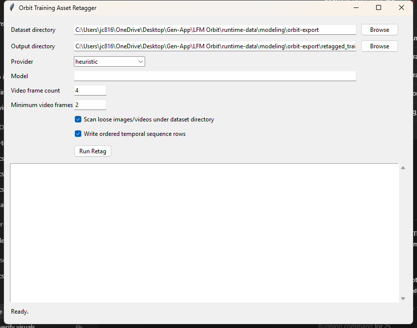

# Orbit Data Folder

This folder is for local data inputs that help Orbit gather, package, retag, and hand off training data. It is not the main runtime cache. Runtime-generated assets normally live under `runtime-data/`, while this folder holds repo-local data packs such as boundaries, local fixtures, or optional operator-managed imports.

## What This Is

Orbit's data cycle is:

1. The app gathers evidence during realtime missions, replay from cached real API imagery, monitor previews, imagery fetches, VLM helper calls, and timelapse generation.
2. The backend stores alert metadata, gallery evidence, thumbnails, videos, observations, agent decisions, and monitor reports.
3. `scripts/export_orbit_dataset.py` packages those records into an Orbit dataset export with JSONL manifests and local assets.
4. `scripts/retag_training_assets.py` walks the export, deduplicates images and frames by SHA-256, extracts timelapse frames, preserves temporal sequence context, and retags assets with a chosen provider.
5. The retagged folder can be reviewed locally, loaded as a Hugging Face ImageFolder dataset, uploaded to Hugging Face, or used by external fine-tuning jobs.
6. Trained artifacts can come back through the model handoff/fetch path documented in `docs/MODEL_HANDOFF.md`.

The goal is a closed loop: collect evidence in Orbit, package it cleanly, retag it with a stronger vision model when useful, train or evaluate externally, then bring model artifacts back into Orbit.

## Folder Roles

- `source/backend/data/`
  Repo-local data inputs and fixtures. Keep this small and intentional.
- `source/backend/data/boundaries/`
  Boundary/concession/protected-area inputs used by overlay import tooling.
- `runtime-data/`
  Mutable local runtime state, generated exports, model bundles, and scratch outputs.
- `runtime-data/modeling/orbit-export/`
  Recommended output location for dataset exports.
- `runtime-data/modeling/orbit-export/retagged_training/`
  Recommended output location for retagged image/frame/sequence training data.

## Export Dataset

From the backend folder:

```powershell
cd source/backend
uv run --no-sync python scripts\export_orbit_dataset.py `
  --output-dir ..\..\runtime-data\modeling\orbit-export `
  --monitor-reports-dir ..\..\runtime-data\monitor-reports `
  --include-seeded-cache
```

The export writes:

- `samples.jsonl`
- `train.jsonl`
- `eval.jsonl`
- `training.jsonl`
- `train_training.jsonl`
- `eval_training.jsonl`
- `manifest.json`
- `samples/<sample_id>/sample.json`
- local assets such as `context_thumb.png` and `timelapse.webm`

Export rows include target task/category/action, temporal use-case metadata, alert scores, agent evidence, local imagery/video references, provenance, replay-cache timelapse rows when enabled, and weak-negative reject rows when available.

## Refresh Sentinel Replay Data

High-quality replay timelapses can be refreshed from Sentinel Hub and then reused by demos and dataset export through the existing `assets/seeded_data/sh_<signature>.webm` cache. The folder name is legacy; the data is stored real API imagery, not generated evidence.

The seeder requests Sentinel SCL quality data before each visual frame. Cloud shadow, medium/high cloud probability, cirrus, no-data, and defective pixels are quality-gated before WebM creation. Accepted frames store `frame_quality` metadata; rejected windows are stored in `_meta.json` under `rejected_windows`.

Credentials can come from environment variables, `.tools/.secrets/sentinel.txt`, or `.tools/.secrets/sh.txt`. The Sentinel Hub Process API uses OAuth credentials. Supported local forms include `SH_CLIENT_ID=...` / `SH_CLIENT_SECRET=...`, two-line legacy secret-then-id files, or labeled trial bundles:

```txt
API <optional-ogc-instance-id>
CLIENTID <oauth-client-id>
CLIENT <oauth-client-secret>
```

```powershell
cd source/backend
uv run --no-sync python scripts\seed_sentinel_cache.py `
  --target rondoniaWS `
  --grid 3 `
  --cell-dim 0.05 `
  --start 2023-01 `
  --end 2025-01 `
  --force `
  --skip-vlm-metadata
```

Current high-quality replay assets:

| Use case | Target | Replay WebM |
|---|---|---|
| `flood_extent` | Pakistan Manchar Lake flood | `assets/seeded_data/sh_24541539.webm` |
| `mining_expansion` | Atacama open-pit mining | `assets/seeded_data/sh_fbe644a9.webm` |
| `ice_cap_growth` | Greenland Ilulissat ice edge abstain preview | Legacy static cache excluded from Fast Replay |
| `ice_snow_extent` | Greenland ice/snow extent replay with NDSI/SCL metadata | Metadata-only curated replay until a refreshed contextual WebM is seeded |
| `maritime_activity` | Suez maritime channel | `assets/seeded_data/sh_2d990c6b.webm` |
| `maritime_activity` | Singapore Strait maritime anchorage | `assets/seeded_data/sh_99548137.webm` |
| `wildfire` | Highway 82 Georgia wildfire candidate | `assets/seeded_data/sh_4015e8b8.webm` |
| `crop_phenology` | Kansas seasonal crop-control sequence | `assets/seeded_data/sh_8342a218.webm` |
| `urban_expansion` | Delhi NCR urban expansion review | `assets/seeded_data/sh_f03170dc.webm` |
| `volcanic_surface_change` | Mauna Loa lava-flow surface-change review | `assets/seeded_data/sh_53c969f1.webm` |
| `flood_extent` | Lake Urmia water persistence review | `assets/seeded_data/sh_3ceea0a9.webm` |
| `urban_expansion` | Black Rock City recurring temporary-settlement review | `assets/seeded_data/sh_73634fe8.webm` |
| `wildfire` | Lahaina wildfire burn-scar recovery review | `assets/seeded_data/sh_a7815591.webm` |
| `flood_extent` | Kakhovka reservoir drawdown review | `assets/seeded_data/sh_b9993f84.webm` |
| `volcanic_surface_change` | Kilauea summit eruption review | `assets/seeded_data/sh_07ea2b1b.webm` |
| `flood_extent` | Lake Mead shoreline recovery review | `assets/seeded_data/sh_c8ec6b43.webm` |

Each replay asset stores a matching `_meta.json` with bbox, frame dates, provider, use-case id, target category, and target task. These rows flow into export when `--include-seeded-cache` is set.

Event-specific wildfire seeds should use explicit date windows and the real Sentinel-2 SWIR/NIR/Red burn-scar composite instead of generic monthly mosaics:

```powershell
uv run --no-sync python scripts\seed_sentinel_cache.py `
  --lat 31.223 `
  --lon -81.836 `
  --grid 1 `
  --cell-dim 0.08 `
  --visual-mode burn_scar `
  --date-window pre-fire=2026-04-01:2026-04-10 `
  --date-window ignition-window=2026-04-20:2026-04-23 `
  --date-window active-fire=2026-04-24:2026-04-26 `
  --date-window latest-clear=2026-04-27:2026-04-28 `
  --skip-vlm-metadata
```

Treat this as candidate evidence until the contact sheet is visually reviewed; cloud, smoke, or missing-scene artifacts should not replace a clearer demo. If too many windows are rejected, widen the date window or pick another clear acquisition instead of forcing a cloudy timelapse.

## Future Risk Watch Manifests

Timestamped watch manifests live under `source/backend/assets/watchlists/`. They are not labels and they are not predictions that an ignition will occur. They record an official risk outlook before the outcome is known so a later verification pass can prove whether Orbit caught something after the valid window.

Current future watch:

| Watch | Valid window | Proof file |
|---|---|---|
| SPC Day 2 critical fire-weather corridor, eastern New Mexico into western Texas | `2026-04-28T12:00:00Z` to `2026-04-29T12:00:00Z` | `assets/watchlists/wildfire_spc_day2_southern_high_plains_2026-04-28.json` |

After the watch window closes, verify against FIRMS/NIFC first. Only seed Sentinel-2 post-event imagery if an independent active-fire or incident source exists inside the bbox.

## Retag Assets

Run the second pass after export:

```powershell
cd source/backend
uv run --no-sync python scripts\retag_training_assets.py `
  --dataset-dir ..\..\runtime-data\modeling\orbit-export `
  --provider ollama `
  --model qwen3.6:27b `
  --max-provider-assets 16 `
  --max-provider-sequences 0
```

`--max-provider-assets` keeps local VLM retagging bounded for show-ready runs. `--max-provider-sequences 0` keeps temporal sequence rows heuristic by default because multi-image local VLM calls are slower; set a positive number when you intentionally want sequence-level model calls.

Use `--reuse-existing-dir <previous-retagged-folder>` to avoid sending already-tagged image hashes back through Qwen/Ollama. Use `--no-reuse-existing-sequences` when sequence-level prompts changed and should be regenerated while still reusing image-level tags.

Provider options:

- `heuristic`
  Local metadata-based retagging. No network or model dependency. Good for dry runs and packaging checks.
- `queue`
  Writes `review_queue.jsonl` for manual or external retagging while still packaging deduplicated assets.
- `ollama`
  Sends images to a local Ollama vision model such as Qwen VL. The CLI and UI default to `qwen3.6:27b` with thinking disabled for cleaner JSON responses.
- `openai`
  Sends images to an OpenAI-compatible vision endpoint. Requires `OPENAI_API_KEY`.

Example with Ollama:

```powershell
uv run --no-sync python scripts\retag_training_assets.py `
  --dataset-dir ..\..\runtime-data\modeling\orbit-export `
  --provider ollama `
  --model qwen3.6:27b `
  --max-provider-assets 16
```

Example with OpenAI-compatible vision:

```powershell
$env:OPENAI_API_KEY = "..."
uv run --no-sync python scripts\retag_training_assets.py `
  --dataset-dir ..\..\runtime-data\modeling\orbit-export `
  --provider openai `
  --model gpt-4.1-mini
```

## Retag Output

The retagger writes:

- `retagged_training/images/`
  Deduplicated image assets and extracted video frames.
- `retagged_training/metadata.jsonl`
  Hugging Face ImageFolder-compatible metadata.
- `retagged_training/retagged_assets.jsonl`
  Full Orbit asset records with provider/model output and source references.
- `retagged_training/training_assets.jsonl`
  Image-level SFT rows.
- `retagged_training/temporal_sequences.jsonl`
  Ordered timelapse sequence records.
- `retagged_training/training_temporal_sequences.jsonl`
  Sequence-level SFT rows.
- `retagged_training/review_queue.jsonl`
  Prompts and references for manual/external review.
- `retagged_training/skipped_assets.jsonl`
  Assets skipped due to unsupported type, unresolved paths, or invalid videos.
- `retagged_training/manifest.json`
  Counts, paths, provider, model, and processing notes.

## Duplicate Policy

Training assets are deduplicated by SHA-256. If the same image or extracted frame appears in multiple samples, Orbit writes one asset row and stores every source under `references`.

This avoids duplicate training examples while preserving auditability.

Extracted timelapse frames are also namespaced by the source video SHA-256. That prevents different samples named `timelapse.webm` from overwriting one another in the generated frame folder.

## Timelapse Policy

Timelapse videos are not trained as opaque video blobs by default.

The retagger:

1. Decodes each video.
2. Rejects videos with fewer than two frames.
3. Samples a configurable number of frames.
4. Deduplicates extracted frames by SHA-256.
5. Writes still-frame training rows.
6. Writes ordered temporal sequence rows so before/after context is preserved.

This matters because a true timelapse must contain multiple contextual satellite imagery slices. A static image that only changes color is invalid temporal evidence and should be reviewed or rejected.

Useful options:

```powershell
uv run --no-sync python scripts\retag_training_assets.py `
  --dataset-dir ..\..\runtime-data\modeling\orbit-export `
  --video-frame-count 6 `
  --min-video-frames 2
```

## Hugging Face Handoff

The retagged folder is shaped so it can be loaded as an ImageFolder-style dataset:

```python
from datasets import load_dataset

ds = load_dataset(
    "imagefolder",
    data_dir="runtime-data/modeling/orbit-export/retagged_training",
)
```

For sequence-aware training, use `training_temporal_sequences.jsonl` alongside the referenced frame paths in `images/`.

Upload helper:

```powershell
cd source/backend
uv run --no-sync python scripts\upload_orbit_dataset_hf.py `
  --dataset-dir ..\..\runtime-data\modeling\orbit-export\retagged_training `
  --repo-id your-user-or-org/lfm-orbit-dataset `
  --create-repo `
  --private
```

The helper reads `HF_TOKEN`, `HUGGINGFACE_HUB_TOKEN`, or `.tools/.secrets/hf.txt`, then calls the `hf` CLI with the token in process environment only. Use `--dry-run` to inspect the upload command without network calls.

Current local packaging result after Sentinel demo seeding:

- Dataset export: `56` current-cycle samples, `24` replay-cache rows, `25` rows with timelapse references, `2` wildfire rows, and `2` volcanic surface-change rows.
- Retag output: `179` deduplicated training assets, `26` temporal sequences, `40` bounded Qwen/Ollama image calls, `6` bounded Qwen/Ollama sequence calls, `74` reused image tags, `9` skipped SVG placeholders, and `0` tagger failures.
- Hugging Face dataset: `Shoozes/LFM-Orbit-SatData`, latest data/card commit `1ebd19065e8a8124372425c4c0df9c0332275c9c`, with `mission_metadata=1` for the metadata-only Greenland ice/snow extent replay.
- Dataset Viewer schema note: upload `source/backend/data/HF_DATASET_CARD.md` as the Hub `README.md` so single-image SFT rows, temporal SFT rows, metadata, mission metadata, and review records load as separate configs instead of one mixed inferred JSON split.

## Optional Tkinter UI

The CLI is the source of truth. `scripts/retag_training_assets_ui.py` is a small Tkinter wrapper around the same retag command; it does not implement separate data logic.

Run it from the backend folder:

```powershell
cd source/backend
uv run --no-sync python scripts\retag_training_assets_ui.py
```



The UI exposes:

- Dataset directory picker.
- Output directory picker.
- Provider selector: `heuristic`, `queue`, `ollama`, `openai`.
- Model text field.
- Frame count and minimum video frames.
- Model image-call and sequence-call budgets. Defaults use Qwen for representative still images and keep sequence rows heuristic unless explicitly enabled.
- Run button that calls `scripts/retag_training_assets.py` in a subprocess.
- Optional Hugging Face upload controls for repo id, create-repo, private repo, and upload-as-PR after a successful retag pass.
- Scrollable output log.
- Manifest summary after a successful run.

Recommended behavior:

- Default `dataset_dir` to `runtime-data/modeling/orbit-export`.
- Default provider to `ollama`.
- Default model to `qwen3.6:27b`.
- Keep provider secrets in environment variables, not UI fields, especially `OPENAI_API_KEY`.
- Disable the run button while the subprocess is active.
- Never write retag output into `source/backend/data/`; keep generated results under `runtime-data/`.

Tkinter is useful for operator convenience, but the repeatable workflow remains the CLI commands above. If Python was installed without Tkinter, use the CLI directly.

## What Goes Where

Use `source/backend/data/` for:

- Boundary files before import.
- Small local fixtures.
- Human-maintained notes about local datasets.

Use `runtime-data/` for:

- Generated dataset exports.
- Retagged training outputs.
- Runtime SQLite files.
- Downloaded model artifacts.
- Large imagery/video caches.

Avoid committing large generated datasets unless the repo intentionally tracks a small replay fixture pack.
